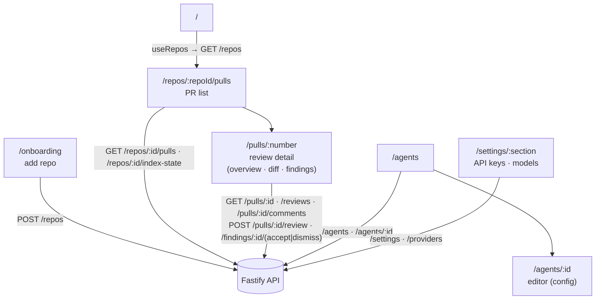

# `@devdigest/web` — the studio (Next.js 15)

The DevDigest UI: import repos, browse pull requests, run and read AI reviews,
and author agents. App Router + React Server/Client components, data via
**TanStack Query** hooks over the Fastify API. (This is the starter surface;
course lessons add the Skills, Memory, Eval, Blast/Brief, multi-agent, CI, and
dashboard screens.)

- **Stack:** Next.js 15 (App Router), React 19, TanStack Query, `next-intl`
  (messages in `messages/<locale>/*.json`), `recharts`, `mermaid`,
  `react-markdown`. UI primitives are vendored under `src/vendor/ui`
  (`@devdigest/ui`) and shared Zod contracts under `src/vendor/shared`
  (`@devdigest/shared`).
- **API base:** `NEXT_PUBLIC_API_BASE` (default `http://localhost:3001`), used by
  `src/lib/api.ts`. Every data hook lives in `src/lib/hooks/*`.
- **Run:** `pnpm dev` (`:3000`). **Test:** `pnpm test` (vitest + jsdom, fetch
  mocked — no API needed). **Typecheck:** `pnpm typecheck`.

## UI route map

Routes (`src/app/**/page.tsx`) and the API surface each leans on (via
`src/lib/hooks/*` → `src/lib/api.ts`):

Cross-cutting chrome lives in `src/components/app-shell` (nav, breadcrumbs,
`g`-then-key shortcuts). Pages are thin; feature logic sits in colocated
`_components/<Name>/` folders, each with its own `*.test.tsx`.

## Agent Performance dashboard & Stats tab

Two more surfaces read `GET /agents/performance` and `GET /agents/:id/stats`
via `src/lib/hooks/agent-performance.ts` (`plans/16-agent-performance-dashboard.md`)
— both hooks share one `PerfRangeValue` shape (`{ days }` or a custom
`{ from, to }`):

- `/agent-performance` (`_components/AgentPerfView/`) — workspace dashboard:
  summary tiles (runs, cost, accept rate, most-active agent), a sortable
  agent table with a low-sample accept-rate marker (`< 20` decisions) and
  row-expand, and cost-by-agent/cost-by-model breakdowns.
- The agent editor's **Stats** tab (`/agents/:id?tab=stats`,
  `AgentEditor/_components/StatsTab/`) — the same figures scoped to one
  agent, so it reconciles with that agent's dashboard row (AC-1).

Both share one range control, `src/components/perf-range-picker/PerfRangePicker/`
— `1`/`7`/`30`/`90`-day presets plus a custom date range, built for the
dashboard and promoted so the Stats tab could reuse it for a like-for-like
comparison.

**Gotcha this feature exposed:** `AgentEditor/constants.ts`'s `TABS` (drives
the tab bar) and `AgentEditorView/constants.ts`'s `VALID_TABS` (gates the
`?tab=` query param) are two separate arrays that must list the same keys —
nothing but a test enforces this, and the failure mode is a silently
unreachable tab, not an error. `constants.test.ts` now asserts `VALID_TABS`
is a superset of `TABS`'s keys; see `LEARNINGS.md`'s 2026-09-23 "Recurring
Errors & Fixes" entry for the incident this closes.

## Testing

Component/interaction tests (`*.test.tsx`) run under vitest + jsdom with `fetch`
mocked, so they need neither the API nor a browser. The real browser journeys
(client + API + seeded DB) are covered by the deterministic agent-browser suite
in [`../e2e`](../e2e/README.md) and the `e2e-web.yml` workflow. See
[`../TESTING.md`](../TESTING.md).
