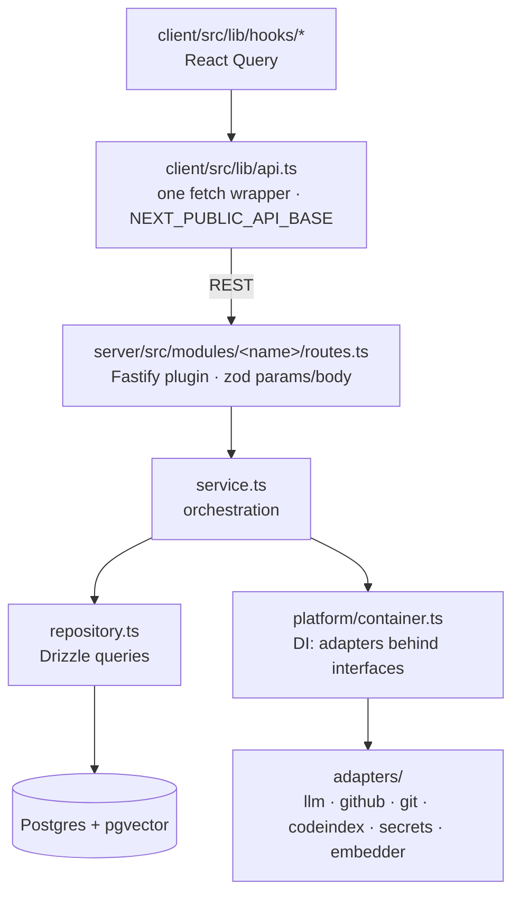
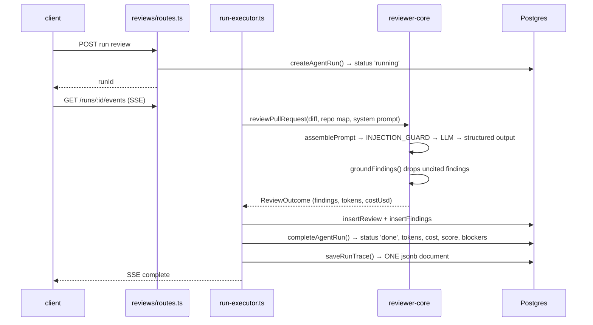

# Architecture — how a request becomes a grounded finding

The high-level picture (packages, ports, the one-paragraph review flow) lives
in the root [README.md](../README.md). This document goes one level deeper:
the actual call path through the layers, the run lifecycle, and where state
lands. Per-package pipelines have their own diagrams —
[reviewer-core](../reviewer-core/README.md) (engine),
[server](../server/README.md) (API map),
[client](../client/README.md) (route map).

## Layers, top to bottom

Two rules hold this together and are easy to violate by accident:

- **Components never `fetch`.** Data access goes hook → `api.ts`. A component
  calling the API directly bypasses caching and the error contract.
- **Services depend on interfaces, not adapters.** Everything reachable from
  `Container` is typed as a `@devdigest/shared` interface (`GitHubClient`,
  `LLMProvider`, `SecretsProvider`, …). Tests inject mocks via
  `ContainerOverrides` rather than mocking at module level.

Modules self-register in [`server/src/modules/index.ts`](../server/src/modules/index.ts) —
one import plus one entry each. Registration is static, not filesystem
autoload, so the same path works under tsx, the bundler and vitest. A module
that isn't in that record is dead code.

## The review run lifecycle

A review is not a request/response — it is a **job with an audit trail**. The
HTTP call returns as soon as the run row exists; progress streams over SSE.

Notes that matter when debugging a run:

- **Failure is persisted, not just thrown.** The `catch` in `run-executor.ts`
  writes `status='failed'|'cancelled'` plus the error text and the log-so-far,
  so a failed run and *why* it failed survive a page reload.
- **Orphan reaping.** Any row still `running` at boot is marked `failed` — its
  process died. Without this, runs stick as "running" forever in the UI.
- **The trace is one document.** The whole run log goes to `run_traces.trace`
  as a single jsonb blob keyed by run id, not row-per-event. Live events go
  over SSE during the run; the document is written once at the end.
- **Outcome ≠ lifecycle.** The timeline badge is derived from the persisted
  blocker/finding counts, not from the model's self-reported verdict — a
  finished run that found blockers reads "rejected", never a green "done".

## Context assembly: what the model actually sees

`repo-intel` ([`server/src/modules/repo-intel`](../server/src/modules/repo-intel))
clones and indexes a repository into symbols and an import graph, then serves
two things into the prompt: a **repo map** (skeleton of the codebase) and
**callers of changed symbols**. This is what the *Indexed* badge reflects.

An unindexed repo does not error — the review silently degrades to
diff-only context. If findings suddenly lack project awareness, check the
index state before suspecting the prompt.

`assemblePrompt` takes optional slots (`skills`, `memory`, `specs`,
`callers`, `repoMap`) and omits any section it wasn't given. The starter
passes only diff, system prompt and repo map; later lessons fill the rest.

## Contracts

Zod schemas in `vendor/shared` are the single definition of every payload
crossing a boundary, and they are also the Fastify route schemas — invalid
input 422s before a handler runs.

The trap: **`server/src/vendor/shared` and `client/src/vendor/shared` are two
independent copies with no sync script**, and they have already drifted.
`reviewer-core`'s path alias points at the *server* copy. Changing a contract
means editing both directories by hand — and divergence type-checks clean in
both packages, so nothing catches it for you.

## Where state lives

Around 40 tables (most belong to later lessons); the ones a review touches:

| Table | Holds |
|---|---|
| `repos` · `pull_requests` · `pr_files` · `pr_commits` | imported GitHub state |
| `agents` · `agent_versions` | reviewer config (model, system prompt, gate) |
| `agent_runs` | one row per run: status, duration, tokens, cost, score, blockers |
| `run_traces` | the full trace of a run, one jsonb doc, FK to `agent_runs` |
| `reviews` · `findings` | the review verdict and its grounded findings |
| `repo_index_state` · `symbols` · `references` | repo-intel index |

Migrations are **not** applied on boot — `cd server && pnpm db:migrate` after
any schema change, or routes fail with `relation ... does not exist`.
