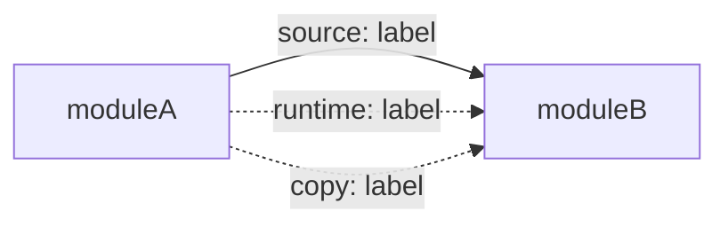

# Dependency Checker

Two lenses, always both: **internal** (which of this repo's own modules
depend on which, and how) and **external** (each module's third-party npm
packages — direct only — by type and on-disk size). Every run ends with a
prioritized action list; a diagram or table alone is not a finished run.

## Scope note specific to this repo

- **No workspace.** Each module — `server`, `client`, `reviewer-core`, `e2e`,
  `mcp-server` — has its own `package.json` + lockfile
  ([root CLAUDE.md](../../../CLAUDE.md), "Conventions"). Shared code crosses
  module boundaries via tsconfig `paths` aliases (compiled together at
  source level), never via a published or npm-linked package.
- **vendor/shared drift.** `server/src/vendor/shared` and
  `client/src/vendor/shared` are independent copies, not auto-synced (root
  CLAUDE.md, "Do-not-touch"). Whenever `@devdigest/shared` is in scope, check
  both copies — this is the one dependency footgun the repo already documents.
- **mcp-server → server is a runtime edge, not a source edge.** mcp-server is
  "a thin translation layer over the Fastify HTTP+SSE API" (its own
  `package.json` description) — it talks to server over HTTP at runtime, with
  no tsconfig path alias and nothing `dependency-cruiser` or a bundler would
  ever see. Report it as a runtime dependency, distinct from a source one.

## Step 1 — Inventory the modules

List every module with its own `package.json`:
`find . -maxdepth 2 -name package.json -not -path "*/node_modules/*"`.
Read each module's `name` and `description` field first — `reviewer-core`
and `mcp-server` already state their dependency role in one line; reuse that
instead of re-deriving it from scratch.

## Step 2 — Internal (component) dependency graph

For each module:

1. Read `tsconfig.json`'s `compilerOptions.paths`. Every alias pointing
   outside that module's own `src/` is a candidate source-level dependency
   edge (e.g. server's `@devdigest/reviewer-core` →
   `../reviewer-core/src/index.ts`).
2. Confirm each candidate is actually used:
   `grep -rl '@devdigest/reviewer-core' <module>/src`. A declared-but-unused
   alias is not a real edge — don't draw it.
3. Separately identify **runtime** edges source-level tooling can't see:
   HTTP/SSE calls to another module's port (check each module's README
   "Port" row, and any `fetch`/base-URL config), CLI/MCP tools shelling out
   to another module, or a DB shared across modules. Keep these visually and
   textually distinct from source edges — conflating them misleads a reader
   about what a bundler or `dependency-cruiser` would actually catch.
4. Note any one-directional copy relationship (vendor/shared) as its own edge
   type ("copy, may drift"), never as a normal dependency.

## Step 3 — External (npm) dependency inventory, per module

For each module, from its `package.json`:

- Split into `dependencies` (prod) and `devDependencies`; count each.
- **Size:** for every *direct* dependency, run
  `du -shL <module>/node_modules/<pkg>`. The `-L` is required — pnpm hoists
  into a per-module `node_modules` of symlinks into a content-addressed
  store, so a plain `du -sh` on the symlink reports near-zero and is simply
  wrong. Don't `du` the whole `node_modules` tree (dominated by shared
  transitive deps, misleading per module) and don't walk every transitive
  dependency (slow, noisy) — direct deps only.
- Prefer this on-disk measurement over registry metadata
  (`npm view <pkg>` tarball size) whenever a local install exists — installed
  size is what actually costs this repo install/build/clone time, and the
  two numbers can diverge a lot (native binaries, platform variants).
- Flag any package declared in more than one module's `package.json` at
  **different** semver ranges — a real drift risk given there's no workspace
  to force a single version.
- Cross-reference Step 2's graph: a dependency installed directly by two
  modules that also share a source or runtime edge (e.g. `zod`, since Zod
  contracts cross the server↔client wire) is worth flagging even on a minor
  version drift — it's a wire contract, not just a library choice.

## Step 4 — Draw the diagram

Write the **component graph** from Step 2 as a fenced Mermaid `flowchart`
directly in the report — never a plain ``` ``` ``` ``` code block or an ASCII
box diagram; those don't render and can't be told apart from any other text
block. This has to work with no tool call, because a tool call may not
always be available (see "environment note" below) — the syntax below is
everything needed for this step, memorize it rather than fetching it:

````

````

Solid `-->` for source edges, dashed `-.->` for runtime edges, dotted
`-. .->` for copy edges — never a full npm dependency tree; a graph of 100+
transitive packages is noise, not insight. If Step 3 turned up a genuinely
oversized or duplicated package worth calling out visually, annotate it on
the relevant module's node rather than drawing a second graph. For anything
beyond this — subgraphs, styling, a diagram type other than `flowchart` — the
`mermaid-diagram` skill has the fuller reference; reach for it only when this
template genuinely doesn't cover the case, not as the default path for a
plain component graph.

**Environment note:** don't assume tool access (`Skill`, `Read`, `Bash`) is
guaranteed at this step. If it's available, fine — draw from Step 2's actual
data either way. If it isn't (e.g. this skill's own content-only quality
evals, `evals/skills/dependency-checker/`, run with no tools by design — see
`evals/README.md`, "Two ways to run a case"), the flowchart above still has
to come out correct from data already gathered, because the report is
incomplete without it.

## Step 5 — Report format

Always produce all four sections, in this order, even when a section is
short:

1. **Component graph** — the Step 4 diagram, plus one sentence per edge
   naming what actually crosses it (a type, a protocol, or "copied source").
2. **Per-module dependency table** — one table per module:
   `package | type (prod/dev) | version range | on-disk size | also installed by`.
3. **Findings & Priorities** — anything Step 2/3 flagged: version drift on a
   shared package, a dependency oversized relative to what it's used for, an
   unused declared alias, a runtime edge with no visible timeout/health-check,
   an internal import that bypasses a module's public entry point. **Every
   finding gets exactly one severity tier, labeled explicitly — never an
   unranked bullet list:**
   - **P0** — breaks or silently corrupts something *now*: a wire-contract
     mismatch (e.g. divergent `zod` versions on a type shared across the
     server↔client boundary), a module importing another's internals by
     relative path instead of its public entry point, a runtime edge with no
     failure handling.
   - **P1** — a real problem without an active break: meaningful version
     drift on a non-contract package, a dependency clearly oversized for
     what it's used for, a vendor/shared copy that's already drifted.
   - **P2** — worth doing, low urgency: a declared-but-unused dependency, a
     devDependency misfiled as a production one, a minor semver spread.
   - **Info** — notable but not actionable on its own (e.g. "four modules
     all depend on `zod`, no drift") — record it, don't manufacture a
     recommendation for it.
4. **Summary** — 3–5 concrete, actionable takeaways, ordered by priority
   (P0s first). Each ties back to one Findings & Priorities entry — a
   takeaway with no finding behind it is padding, not a takeaway. Rank by
   blast radius × ease, not by category or by module order.

See [examples.md](examples.md) for a worked sample of this shape.

## What this skill must not do

- Never treat `server/.dependency-cruiser.cjs` as this skill's job to
  rewrite — that config enforces onion-architecture ring layering *inside*
  `server/src`, an orthogonal concern to cross-module or npm dependencies.
  Read it for context if useful; don't edit it here.
- Never report a `tsconfig.json` path alias as a real dependency edge without
  Step 2.2's grep confirming an actual import exists.
- Never estimate package weight from registry/tarball metadata when a local
  `node_modules` install is available — see Step 3.
- Never draw the full transitive npm graph — component-level and
  direct-dependency-level only (Step 4).
- Never skip the vendor/shared drift check when `@devdigest/shared` is in
  scope — it is the one dependency footgun root CLAUDE.md already documents.
- Never run a security/CVE audit as part of this — that's the `security`
  skill or `/security-review`; this skill reports weight and structure, not
  vulnerabilities.
- Never make the Step 4 diagram depend on a tool call succeeding — write the
  `flowchart` inline from Step 2's data every time. A step whose output only
  exists if a tool call happens to be available isn't reliable: this skill's
  own content-only quality evals run with none, and a fenced ASCII box
  diagram or a "delegating to X" aside is not a substitute for the real
  Mermaid block the report requires.
