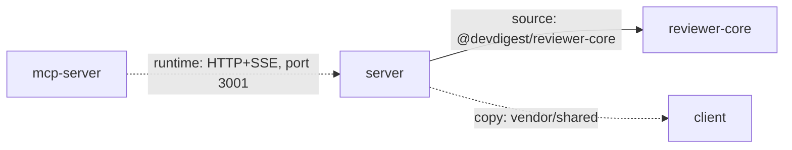

# What a finished report looks like

A compact worked sample of the Step 5 shape — real numbers below are
illustrative, not a guarantee of current repo state; always re-measure.

## 1. Component graph

- `server → reviewer-core` (solid): source-level import via tsconfig path
  alias, compiled together — a `reviewer-core` API change breaks server's
  typecheck immediately.
- `mcp-server → server` (dashed): runtime HTTP+SSE call to port 3001, no
  compile-time link — a breaking API change here fails at request time, not
  build time.
- `server ⇢ client` (dotted): `vendor/shared` is copied, not imported —
  edits to one side never propagate to the other (root CLAUDE.md,
  "Do-not-touch").

## 2. Per-module dependency table

One table per module. Server excerpt:

| package | type | version range | on-disk size | also installed by |
|---|---|---|---|---|
| `zod` | prod | `^3.24.1` | 5.0M | client (`^3.24.1`), reviewer-core (`^3.24.1`), mcp-server (`^3.24.1`) |
| `dependency-cruiser` | prod | `^17.4.3` | 42M | — |
| `@ast-grep/napi` | prod | `0.43.0` | 61M (native) | — |

## 3. Findings & Priorities

Every finding carries exactly one tier — never an unranked bullet list.

- ❌ Not a finding: "`zod` is used in four modules." (No drift, no size
  concern — just a fact, not actionable. If it's worth keeping, it's **Info**,
  not P0-P2.)
- ✅ **P2** — "`dependency-cruiser` (42M) is a `dependencies` entry in
  server's `package.json`, not a `devDependency` — it's only invoked via the
  `arch`/`arch:all`/`arch:baseline` scripts (`server/package.json`), never
  imported by `src/`. It ships into any production install unnecessarily."
- ✅ **P0** — "`server/src/services/review-service.ts` imports
  `reviewer-core/src/pipeline.js` directly by relative path instead of
  through `reviewer-core`'s public entry point (`reviewer-core/src/index.ts`)
  — an internal-API change there can silently break server with no type
  error at the package boundary."
- ✅ **Info** — "`zod` is installed directly by four modules at matching
  semver ranges — no drift, nothing to act on, noted for completeness."

## 4. Summary

3-5 concrete, actionable takeaways, ordered P0 first — each ties back to a
Findings & Priorities entry above. The bar: **a concrete action, the
module(s) it touches, and the finding that justifies it.** No cited finding,
not a takeaway.

❌ "Clean up dependencies." — not specific to any package, no evidence, no
tier, not actionable.

✅ "**P0** — Fix `server/src/services/review-service.ts`'s relative import
into `reviewer-core/src/pipeline.js`; route it through
`reviewer-core/src/index.ts` instead, so a `reviewer-core` refactor can't
silently break server without a type error."

✅ "**P2** — Move `dependency-cruiser` from `dependencies` to
`devDependencies` in `server/package.json` — it's build/CI tooling only, and
the change is a one-line, zero-risk edit that trims every production install
by 42M."

The P0 outranks the P2 regardless of how small the P2's diff is — severity
tier decides order first, ease breaks ties within a tier.
