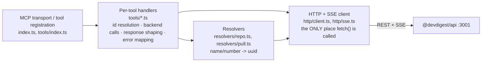

# `@devdigest/mcp-server` — local MCP server

A thin **local stdio** MCP server that exposes Dev Digest's review/conventions
functionality to a Claude Code session, so it can list agents, trigger a
review, read findings, and read conventions without leaving the chat. No
domain logic or persistence of its own — it's a translation layer between MCP
tool-call semantics and the existing Fastify REST/SSE API
(`@devdigest/api`, port 3001).

Launched **on demand** by Claude Code via the project-scoped `.mcp.json` at
the repo root — never by `./scripts/dev.sh`. Requires the server (and
usually the dev stack) to already be running; it makes no attempt to start
one itself.

## Tools

| Tool | What it does |
|---|---|
| `list_agents` | Lists the workspace's agent configs (id, name, provider/model, enabled). |
| `run_agent_on_pr` | Runs one agent on one PR and **blocks** (up to 120s) until it finishes, returning the verdict + findings. |
| `get_findings` | Reads the most recent completed review by one agent on one PR — a pure read, safe to poll. |
| `get_conventions` | Reads a repo's already-**accepted** coding conventions from its last scan. |
| `get_blast_radius` | **Stub** — always returns a structured "not implemented" result; makes zero backend calls. |

Exact schemas + the verbatim tool descriptions actually used at registration
time live in `src/tools/*.ts`; see [`../specs/06-mcp-server.md`](../specs/06-mcp-server.md)
for the design rationale (why each tool is shaped the way it is, the exact
backend call sequences, and the full error-handling table).

## Layers

`http/client.ts` takes an injectable `fetchImpl` (default: global `fetch`),
matching this repo's DI-based test-double convention
(`server/src/adapters/mocks.ts`) — every layer above is tested against a
hand-written fake, never module-level mocking.

This package defines its **own minimal local types** (`src/tools/review-shape.ts`,
the raw-row interfaces in each resolver/tool) rather than importing
`server`'s vendored zod contracts (`@devdigest/shared`) — a deliberate
decoupling so it can't silently break when `server/src/vendor/shared` drifts.
No `@devdigest/shared` path alias here, unlike `reviewer-core`.

## `run_agent_on_pr`'s blocking design

`POST /pulls/:id/review` is **fire-and-forget** — it returns immediately with
a `run_id` and an always-empty `reviews: []`; the review executes in the
background. This tool detects completion by holding open the SSE stream at
`GET /runs/:id/events` until it **closes** (the race-free completion signal —
see `mcp-server/LEARNINGS.md`), relaying each event as a
`notifications/progress` notification when the caller supplied a
`progressToken`. If the ~118s wait budget elapses first, it returns a timeout
notice (not the result) — the run keeps going server-side; call
`get_findings` afterward to pick it up.

## Config

- `DEVDIGEST_API_BASE_URL` — the API's base URL. Default `http://localhost:3001`.
- No auth: the backend's `LocalNoAuthProvider` always resolves a default
  workspace/user regardless of headers, so this package sends none.

## Testing

`pnpm test` (vitest) — entirely hermetic (no server, no network, no DB):
zod input-schema validation, resolver matching (exact/case-insensitive/
ambiguous/zero-match), response shaping, the full error-handling table
(including a 429-detected-by-status regression test), SSE frame parsing
(including a frame split across chunk boundaries), and the wait-timeout path
via an injectable budget override. `get_blast_radius`'s test asserts the
mocked `fetch` is **never called**. `pnpm typecheck` doubles as the build —
this package never emits JS; it's run directly via `tsx` (see `.mcp.json`).

A real dev-stack smoke test (all 5 tools via `npx @modelcontextprotocol/inspector`
or Claude Code itself, including one real `run_agent_on_pr`) is **not** part
of `pnpm test` — see [`../specs/06-mcp-server.md`](../specs/06-mcp-server.md)
"Verification".
