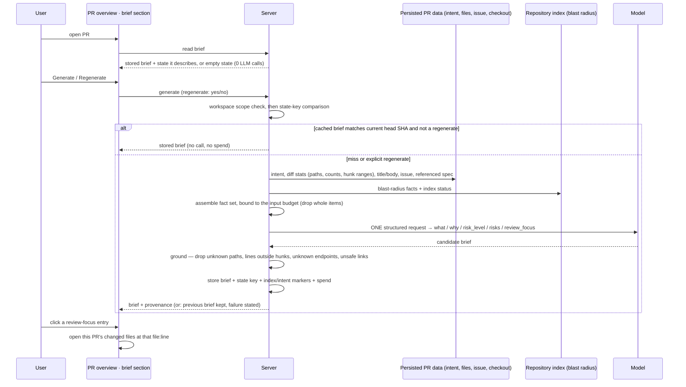

# Spec: PR Why + Risk Brief   |   Spec ID: SPEC-11   |   Status: approved

Feature 3 of the "Project Context" epic (L05 in the roadmap: *Project Context
Folder · Onboarding generator · PR Brief card*), after SPEC-09 and SPEC-10. It is
also the "dedicated blast-radius-derived-risk spec" that
[specs/05-intent-layer.md](05-intent-layer.md)'s Revision note deferred
`risk_areas` to, now widened to also carry *what*, *why* and a review-focus list.

**Affected modules:** `server`, `client`. Cross-module, hence a root spec.
`reviewer-core` is deliberately untouched (D14); `mcp-server` and `e2e` are
non-goals for this slice (N7, N8).

## Problem & Motivation

A reviewer opening a pull request today gets four things: a verdict/score summary
from whatever review runs have happened, an Intent card (what the author says the
PR does, in/out of scope), a Blast Radius card (which symbols changed and what
calls them), and the diff. What they still have to assemble in their own head is
the thing they actually need in the first thirty seconds:

- **What** does this change, in one plain sentence.
- **Why** does it exist — the motivation behind the diff, not a restatement of it.
- **How risky** is it, as one judgement they can triage against.
- **Which specific risks** does it carry, each anchored to a real file.
- **What to read first** — an ordered short list, not a nine-file diff to skim.

Every ingredient already exists and is already paid for. Intent is resolved and
cached on the PR (L03). Blast Radius is a deterministic index read (L04). Diff
stats — file paths, added/removed counts, hunk ranges without any hunk body — are
already loaded on the review path. The linked issue is already parsed and fetched.
The referenced in-repo spec is already read. Nothing here needs new ingestion; it
needs one structured synthesis over facts the product already holds.

The codebase reserved this space explicitly, in four independent places:

1. `FeatureModelId` already lists `risk_brief` with a `FEATURE_MODELS` entry
   ("Risk Brief — Assesses merge risks for a pull request"), in both
   `vendor/shared/contracts/platform.ts` copies. **No new feature-model id is
   needed** — unlike SPEC-10, which had to add one.
2. `Risk` / `RiskSeverity` / `Risks` and a composed `PrBrief` are defined in both
   `vendor/shared/contracts/brief.ts` copies and consumed by nothing.
3. The `pr_brief` table exists with zero rows and zero readers; SPEC-06 and
   SPEC-07 both explicitly declined to touch it, naming this lesson.
4. SPEC-05 named `risk_areas` and pushed it here by name.

The reserved shapes do **not** all fit the feature as asked, so this spec resolves
each one explicitly rather than silently — see *Decisions against reserved code*.

## Goals / Non-goals

### Goals

- **G1** — Produce, per pull request, one stored brief containing *what*, *why*,
  an overall *risk level*, a list of concrete *risks*, and an ordered
  *review-focus* list.
- **G2** — Assemble the brief's input entirely from facts the product already
  computes: derived intent, blast radius, diff **stats**, the linked issue, and
  the spec the PR references. No hunk bodies, no source file contents, ever.
- **G3** — Spend exactly **one** structured LLM call per generation, chosen
  through the already-reserved `risk_brief` feature-model selection.
- **G4** — Ground every citation deterministically: a risk or review-focus item
  may name only files, lines, endpoints and symbols that are present in the input
  fact set. Anything else is dropped, never rewritten and never displayed.
- **G5** — Cache the brief against the PR's current state so that re-opening the
  same PR state costs zero LLM calls, with an explicit regenerate action as the
  only way to force a fresh call.
- **G6** — Show it on the PR detail page as a card whose risk level is immediately
  legible and whose review-focus items are clickable — each one taking the
  reviewer to the file it names.
- **G7** — Make the spend visible and attributable (model, attempts, tokens, cost,
  when it was generated, and against which PR state).
- **G8** — Be honest about what it does not know: an absent intent, an absent
  issue, a degraded index, or an empty risk list are each stated, never papered
  over with invented prose.

### Non-goals (explicitly out of scope for this slice)

- **N1 — The "Why Timeline"** (a history of briefs across a PR's commits, showing
  how intent drifted). Stated as the assignment's stretch goal and deliberately
  deferred: it needs a per-commit brief history, a diffing/presentation model for
  successive briefs, and a cost story for generating a brief per commit. This
  slice stores **one current brief per PR** (D8), which is the natural predecessor
  of that feature, not an obstacle to it — a follow-up widens the cache from one
  row per PR to one row per (PR, state), and this spec's state key (D9) is exactly
  the column that follow-up would key on.
- **N2 — Sending any diff hunk body, patch text, or source file content to the
  model.** Hard boundary, not a budget preference (AC-2).
- **N3 — Producing review findings.** The brief points at code; it does not judge
  it line by line, does not create, accept, dismiss or replace findings, and does
  not participate in any review run's verdict or score.
- **N4 — Consuming existing review findings as an input** in this slice — see D3
  and open question 1.
- **N5 — Automatic generation.** No brief is generated by opening a page,
  importing a repo, polling, syncing, or completing a review run (D13).
- **N6 — Editing or overriding a brief by hand**, and no per-risk accept/dismiss
  action. A brief is regenerated, never curated.
- **N7 — An MCP tool** exposing the brief. Not asked for, and the read surface it
  would wrap does not exist until this ships.
- **N8 — An e2e browser flow.** Consistent with SPEC-09/SPEC-10, which also left
  e2e out (see open question 5).
- **N9 — A brief badge or risk level on the PR list rows.** Detail page only.
- **N10 — The `PrHistory` / "Prior PRs touching these files" panel** visible in the
  L04/L05 mockups. It is a separate reserved contract, untouched here (D7).
- **N11 — Any change to how intent or blast radius are computed, cached or
  displayed.** This feature is a pure consumer of both.

### Decisions resolved from the design sources

The Overview-tab screenshot is the visual target. Three genuine gaps in it are
resolved here rather than left open. (The second screenshot — the reviewer-ordered
Files-changed tab — is unrelated to this feature and contributes nothing to it.)

- **D1 — The mockup's "PR BRIEF" label sits over the *existing* verdict/score
  block, not over this feature.** In the screenshot, "PR BRIEF" heads the
  Request-changes/61-score summary, which is the shipped review summary and
  nothing to do with this spec. Resolution: this feature's card gets its own
  distinct section label and **no label is added to the verdict/score block**,
  which today has none. Two adjacent regions both labelled "PR Brief" would be
  actively misleading — one is a review's verdict, the other is a pre-review
  orientation. *(Suggestion, not decided here: if the product later wants the
  verdict block labelled, it should be labelled as a review summary.)*
- **D2 — *What* and *why* have no home in the mockup; this spec gives them one,
  and the risk areas move.** The screenshot shows RISK AREAS tucked under the
  in/out-of-scope lists inside the Intent card, REVIEW FOCUS as a separate
  full-width card, and no region at all for *what*/*why*. Resolution: this feature
  renders **one full-width section** carrying, in order — risk level + provenance,
  *what*, *why*, RISK AREAS, REVIEW FOCUS (AC-36..AC-38). The risk areas do **not**
  live inside the Intent card, despite the mockup, because intent and the brief
  have different sources, different lifecycles and different refresh triggers:
  intent is recomputed on every review run, while a brief is generated only on
  request and cached against the PR state. Putting them in one container would
  make "which half of this card is stale?" unanswerable to the reader.
- **D3 — The mockup's review-focus copy asserts things a stats-only input cannot
  know.** Its four items ("live Stripe key committed in plaintext",
  "callback_url forwards the account token", "429 branch omits the Retry-After
  header", "N+1 query") are line-level defect claims — the same ones the second
  screenshot shows as review blockers. A model given file paths, add/delete counts
  and hunk ranges but no hunk bodies (N2) cannot see any of them. Resolution: this
  slice's review-focus items answer **"where to look and why that place carries
  the most risk in this change"** — grounded in blast radius, change size, and
  declared scope — and the feature must never present a review-focus item as an
  asserted defect (AC-19, AC-21). Folding already-computed review findings in as
  an extra input would make the mockup's exact copy reachable at zero extra LLM
  cost; that is a real, attractive follow-up, deliberately not taken here because
  it would make the brief post-review-only, and the brief's whole value is being
  available *before* anyone reviews. See open question 1.

### Decisions against the reserved code

- **D4 — Reuse `Risk` and `RiskSeverity` verbatim for `risks[]`.** The reserved
  shape (`kind`, `title`, `explanation`, `severity`, `file_refs[]`) maps
  one-to-one onto the mockup's risk tags: icon by `kind`, tag text from `title`,
  `file:line` from `file_refs`, and the expand chevron reveals `explanation`. This
  is the strongest fit of any reserved shape here, and matches SPEC-07's
  reuse-over-reinvention precedent exactly. `risk_level` reuses the same
  `RiskSeverity` value set rather than introducing a second three-valued scale.
- **D5 — Constrain `kind` to a documented closed vocabulary, without changing its
  type.** The reserved field is a free string, which would leave the card's
  icon/colour mapping partial by construction. Resolution: the model must choose
  `kind` from a documented set (auth/permissions surface, dependency, performance,
  data/migration, API contract, configuration/secrets, test coverage, other), and
  an unrecognised value is normalised to *other* — never a reason to drop the risk
  (AC-15).
- **D6 — Redesign the composed `PrBrief` contract in place; do not add a second
  contract beside it.** The reserved `PrBrief` (`intent` + `blast` + `risks` +
  `history`) describes a *composition of four separately-sourced pieces*; this
  feature is a *single model-authored artifact*. Leaving the old shape as dead
  code next to a live near-namesake is precisely the trap `server/LEARNINGS.md`
  (2026-08-04) already documented — "this codebase can reserve more than one
  integration point under the same name for different lessons" — and it cost a
  previous lesson real time. Both the contract and the table have zero consumers
  and zero rows, so redesign-in-place needs no shim and no migration of data, the
  same call SPEC-10 made for the `onboarding` table. Consequences: `PrBrief`
  becomes `{ what, why, risk_level, risks[], review_focus[] }` plus provenance;
  `intent` and `blast` are **not** embedded copies (they have their own live read
  surfaces and their own freshness; a frozen copy inside the brief would be a
  second source of truth that silently disagrees with the cards next to it);
  `history` leaves the composition (N1/N10).
- **D7 — `PrHistory`, `SmartDiff`, `Intent` and `BlastRadius` in
  `contracts/brief.ts` are left exactly as they are.** `SmartDiff` and
  `BlastRadius` are live contracts owned by shipped features; `Intent` and
  `PrHistory` stay reserved. This spec touches only the `Risk`-family and
  `PrBrief` parts of that file (and, per root `CLAUDE.md`, in **both** unsynced
  `vendor/shared` copies).
- **D8 — Reuse the `pr_brief` table, redesigned in place: one row per pull
  request, holding the current brief plus its state key and provenance.** It is
  reserved for exactly this feature by two prior specs and has never held a row.
  One-row-per-PR (rather than one-row-per-state) is the SPEC-10 shape and keeps
  N1's follow-up as an additive change.
- **D9 — The cache state key is the pull request's head SHA.** A cache *hit*
  requires head-SHA equality and nothing else, which is what makes AC-24
  ("reopen the same PR state → no LLM call") hold unconditionally. The index state
  and the intent's resolution time are additionally **recorded** at generation and
  used only to mark a brief *stale* for the reader (AC-30) — the SPEC-10 AC-23
  stale-not-regenerate posture. Rejected alternative: a composite fingerprint over
  head SHA + index SHA + intent timestamp, which would turn a background reindex
  into a cache miss and, with any auto-generation, into a surprise bill.
- **D10 — Grounding is a deterministic post-pass, not prompt-only trust.** The
  assignment's own acceptance bar ("risks reference only real files") is a
  property of the output, and the repo has two precedents for enforcing exactly
  that class of property: `groundFindings` in `reviewer-core` (the review path)
  and `groundTour` in the onboarding module (a feature-local, pure, drop-don't-
  rewrite pass, written specifically because `reviewer-core`'s function is
  do-not-touch and the feature is not a review). This feature follows the
  `groundTour` precedent for the same two reasons: it is not a review, and nothing
  here may enter the review path. Prompt-only grounding is rejected — it is the
  same instruction-level-not-enforced weakness SPEC-05 already accepted for scope
  filtering and flagged as a risk, and here it is cheap to actually enforce
  because every legal citation is already in the fact set.
- **D11 — "Relevant specs" means the spec the PR itself references, not the
  agent-attached project-context documents of SPEC-09.** SPEC-09 attachments are
  *agent-* and *skill-*scoped configuration; a brief has no agent, so there is no
  non-arbitrary way to choose whose attachments apply, and picking "all agents'"
  would make the input non-deterministic as agents are edited. The narrow path —
  the in-repo spec parsed out of the PR title/body, read from the repo checkout —
  is the one Intent already uses, is deterministic, and is bounded to one document.
  SPEC-09's own N1 ("no automatic, content-based selection of documents") points
  the same way. *(Suggestion for a follow-up: if a brief should see project
  invariants, the honest design is repo-scoped context documents, which SPEC-09
  discovery already enumerates — not a borrowed agent attachment list.)*
- **D12 — The input budget for the one call is fixed here at 8,000 tokens**,
  counted with the same token counter the product already uses everywhere else,
  and applied to the assembled model input (AC-9). This spec fixes the number
  rather than delegating it (as SPEC-09 open question 3 and SPEC-10 D12 did for
  theirs) because it is an explicit acceptance criterion of the assignment, not an
  incidental tuning knob. The planner may lower it with a documented reason; it may
  not raise it without changing this spec. The reduction *rule* at the cap is also
  fixed: drop whole lowest-priority input items, never truncate one mid-item
  (AC-8).
- **D13 — Generation happens only on an explicit user action.** Opening the PR page
  renders the stored brief or an explanatory empty state, and never spends
  (AC-23). This is SPEC-10 AC-19's posture, and it is what makes AC-24 observable
  rather than theoretical. "Regenerate" is the same action against an existing
  brief (AC-26).
- **D14 — `reviewer-core` is out of scope.** It is a pure review engine with no DB,
  GitHub or filesystem access, whose one side effect is a review call. The brief is
  not a review, needs the DB and the checkout, and follows the same precedent
  SPEC-10 D9 set: the server module makes its own structured call.
- **D15 — The blast-radius facts given to the brief must not silently lose the
  2-hop-only impacts.** `server/LEARNINGS.md` (2026-08-06) records an open
  question left explicitly *to this lesson*: endpoints/crons reached only through
  the 2-hop reverse-import walk are computed but have nowhere to sit in the
  `BlastRadius` contract, because they belong to no changed symbol's caller group.
  Resolution at spec level: those impacts are part of what "this change can affect"
  means, so the brief's fact set must include them (AC-5); whether that is done by
  widening the shared contract or by the brief reading the blast computation
  directly is a planning decision, not a spec one.

## User stories

- **US-1** — As a reviewer opening an unfamiliar PR, I read one card that tells me
  what it changes, why, and how risky it is, so I can triage it in seconds instead
  of reading nine files. *(AC-3, AC-4, AC-13, AC-14, AC-36)*
- **US-2** — As that reviewer, I see concrete risk areas — not "this touches auth"
  in the abstract, but a named risk anchored to a real file in this PR. *(AC-15,
  AC-16, AC-17, AC-37)*
- **US-3** — As that reviewer, I get an ordered "read these first" list and click
  an entry to land on that exact file and line in this PR's changes. *(AC-19,
  AC-20, AC-38, AC-39)*
- **US-4** — As a workspace owner, generating a brief costs exactly one call, and
  I can see which model ran it, how many tokens it used, and what it cost.
  *(AC-1, AC-8, AC-9, AC-10, AC-11, AC-12, AC-29, AC-43)*
- **US-5** — As a user re-opening a PR I already briefed, nothing is spent, and
  the brief I get is the one I already paid for. *(AC-23, AC-24)*
- **US-6** — As a user whose PR has moved on since the brief was written, I am told
  the brief describes an older state, and nothing regenerates behind my back.
  *(AC-25, AC-30)*
- **US-7** — As a user who wants a fresh take on the same state, one explicit
  action regenerates it, and clicking it twice quickly does not bill me twice.
  *(AC-26, AC-27)*
- **US-8** — As a user whose generation just failed, I keep the brief I had, I am
  told it failed, and I can retry. *(AC-28, AC-33)*
- **US-9** — As a reviewer, every file, line, endpoint and symbol the brief names
  is real and belongs to this change — I never chase a path that does not exist.
  *(AC-5, AC-6, AC-16, AC-17, AC-18, AC-19, AC-20, AC-22)*
- **US-10** — As a reviewer of a PR with no description, no linked issue and no
  intent yet, the brief tells me the *why* is unstated rather than inventing one.
  *(AC-31, AC-35)*
- **US-11** — As a reviewer of a PR on a repo with a degraded or missing index, I
  still get a brief, and it says plainly how much of the impact analysis it could
  actually see; and a pull request with nothing changed at all is refused rather
  than briefed. *(AC-31, AC-32, AC-41)*
- **US-12** — As a security-conscious owner, a PR whose title, body, linked issue,
  referenced spec or file names contain hostile text cannot use my brief
  generation to issue instructions to the model or to inject markup into my
  browser. *(AC-2, AC-21, AC-40, AC-44)*
- **US-13** — As a keyboard or screen-reader user, I can generate a brief, expand a
  risk, open a review-focus target, and be told when the brief's status changes.
  *(AC-42)*
- **US-14** — As a reviewer whose change carries no notable risk, the card says so
  explicitly instead of showing an empty box I cannot interpret. *(AC-34)*

## Acceptance criteria (EARS)

*Terms used below.* The **fact set** is the deterministic input of AC-1..AC-9. A
**brief** is a stored, successfully generated, grounded artifact. A **citation** is
any file path, file:line reference, endpoint, cron or symbol name appearing
anywhere in a brief. The **state key** is the pull request's head SHA (D9).

### Deterministic input assembly

- **AC-1** — The system shall assemble the entire fact set for a pull request
  without making any LLM call, reading only data the product already persists or
  already computes for that pull request.
  *Verify: assemble a fact set against a stubbed provider and assert zero provider
  calls.*
- **AC-2** — The fact set shall contain no diff hunk body, no patch text, and no
  source-file content; the diff shall be represented only as file paths, per-file
  added/removed line counts, hunk ranges, and whole-PR totals.
  *Verify: for a PR whose patch contains a unique sentinel string, that string is
  absent from the assembled model input.*
- **AC-3** — The fact set shall include the pull request's derived intent — its
  summary, in-scope and out-of-scope lists, and its context gaps — read from the
  cached value, and the system shall not recompute intent as part of assembling it.
  *Verify: generating a brief does not change the PR's intent-resolved timestamp.*
- **AC-4** — The fact set shall include the pull request's title, body, and the
  linked issue's title and body where an issue is referenced and resolvable.
- **AC-5** — The fact set shall include the blast-radius facts for the pull
  request's changed files — changed symbols, their cross-file callers, and the
  impacted endpoints and crons — including impacts reached only through the
  reverse-import walk that cannot be attributed to an individual changed symbol,
  together with the index's status.
  *Verify: for a fixture whose only endpoint impact is reachable at two import
  hops, that endpoint is present in the assembled fact set.*
- **AC-6** — WHERE the pull request's title or body references an in-repo spec
  document, the fact set shall include that document's content read from the
  repository checkout, and shall include no other project document.
- **AC-7** — IF a referenced issue or spec cannot be resolved or read, THEN the
  system shall record it as unavailable in the fact set and continue, never
  failing assembly.
- **AC-8** — IF the assembled fact set would exceed the input budget, THEN the
  system shall drop whole lowest-priority items until it fits — never truncating an
  item mid-content — and shall record what was dropped.
  *Verify: a PR with hundreds of changed files yields an input within budget, with
  the dropped item count recorded.*
- **AC-9** — The assembled model input for one generation shall not exceed **8,000
  tokens**, counted with the same token counter the product already uses for skill
  bodies and per-run attribution.
  *Verify: for a deliberately oversized fixture PR, the counted input is at or
  below the budget.*

### The one structured call

- **AC-10** — WHEN a user triggers generation for a pull request, the system shall
  make exactly one structured completion request and no other LLM call anywhere in
  the generation path.
  *Verify: trigger a generation against a stubbed provider and assert exactly one
  structured request and zero completions or embeddings.*
- **AC-11** — WHERE the provider reprompts to repair a schema-invalid response,
  the system shall treat those reprompts as attempts of the same request and record
  the attempt count with the request's summed token usage, not as a second
  generation.
- **AC-12** — The system shall select the model for this call from the workspace's
  configured choice for the risk-brief feature, falling back to that feature's
  documented default, and shall not introduce a second feature-model identity for
  it.
- **AC-13** — WHEN a generation succeeds, the brief shall contain a *what*, a
  *why*, one overall *risk level*, a list of risks, and an ordered review-focus
  list.
- **AC-14** — The system shall bound a brief: *what* and *why* of at most two
  sentences each, at most 6 risks, and at most 5 review-focus entries, irrespective
  of pull-request size.
  *Verify: a fixture PR touching hundreds of files still yields sections within
  these bounds.*
- **AC-15** — Each risk shall carry a kind drawn from the documented closed
  vocabulary — an unrecognised kind being normalised to that vocabulary's *other*
  value rather than causing the risk to be dropped — plus a title, a
  one-to-two-sentence explanation, a severity, and at least one file reference.
  *Verify: a stubbed response whose risk kind is an invented string renders that
  risk under the* other *kind.*

### Grounding

- **AC-16** — IF a risk's file reference names a path that is not present in the
  fact set — neither a file changed by this pull request nor a file named by its
  blast-radius facts — THEN the system shall drop that reference rather than
  displaying it.
  *Verify: a stubbed response citing `src/does-not-exist.ts` yields a brief with no
  such reference.*
- **AC-17** — IF a risk has no surviving file reference after AC-16, THEN the
  system shall drop that risk whole.
- **AC-18** — IF a brief names an endpoint, cron or symbol that is not present in
  the fact set's blast-radius facts, THEN the system shall drop that citation.
- **AC-19** — Each review-focus entry shall name exactly one file changed by this
  pull request together with a single-sentence reason; IF an entry names a file
  this pull request does not change, THEN the system shall drop that entry.
  *Verify: a stubbed response whose focus entry cites an unchanged file yields a
  brief without that entry.*
- **AC-20** — WHERE a review-focus entry or a risk reference carries a line or line
  range, that line shall fall within a changed hunk range of the file it names; IF
  it does not, THEN the system shall keep the entry with the file only and discard
  the line.
  *Verify: a stubbed response citing a line outside every hunk renders a file-level
  reference and no line number.*
- **AC-21** — The system shall neutralise, in every free-text field of a brief, any
  link or image whose target is not a repository-relative path present in the fact
  set, keeping the visible text and discarding the link.
  *Verify: a stubbed explanation containing an external link renders as plain text
  with no live link.*
- **AC-22** — The system shall apply grounding before a brief is stored, so that no
  ungrounded citation is ever persisted or displayed.

### Caching, regeneration and freshness

- **AC-23** — WHEN a user opens a pull request's page, the system shall render the
  stored brief, or an explanatory empty state where none exists, and shall make no
  LLM call.
  *Verify: repeated page loads against a stubbed provider produce zero provider
  calls.*
- **AC-24** — WHEN generation is requested for a pull request whose stored brief
  was generated from the current state key, the system shall return the stored
  brief and shall make no LLM call.
  *Verify: two successive generation requests with no intervening push produce
  exactly one provider request.*
- **AC-25** — WHEN the pull request's state key has changed since its stored brief
  was generated, the system shall present the stored brief as describing an earlier
  state, naming that state, and shall not regenerate it automatically.
- **AC-26** — WHEN a user triggers regenerate, the system shall make a fresh
  structured call even where the stored brief matches the current state key, and
  shall replace the stored brief only if the new generation succeeds.
- **AC-27** — WHILE a generation is in flight for a pull request, the system shall
  not start a second generation for that pull request and shall surface the
  in-flight state rather than queueing or duplicating the call.
  *Verify: two rapid regenerate actions produce one provider request.*
- **AC-28** — IF a generation fails, THEN the previously stored brief shall remain
  intact and displayed, and no partial or ungrounded content shall be stored.
- **AC-29** — WHEN a generation succeeds, the system shall store with the brief:
  the state key it was generated from, the index state and intent resolution time
  at that moment, the model and provider used, the attempt count, tokens in and
  out, the estimated cost, and the generation timestamp.
- **AC-30** — WHERE the state key still matches but the repository index or the
  pull request's intent has advanced since generation, the system shall mark the
  brief as possibly stale, naming what moved, and shall not regenerate it
  automatically.

### Degraded, empty and failure states

- **AC-31** — IF a pull request has no changed files, THEN the system shall refuse
  to generate, state why, and make no LLM call.
  *Verify: triggering generation on a PR with an empty file list produces zero
  provider calls and a stated reason.*
- **AC-32** — WHERE the repository index is partial, degraded, or absent, the
  system shall still generate, shall include the index status in the fact set, and
  shall state on the rendered brief how complete the impact analysis behind it was.
- **AC-33** — IF the structured call fails, times out, or returns a response that
  cannot be validated after its permitted attempts, THEN the system shall report
  the failure, offer a retry, and never display model-authored prose from a failed
  generation.
- **AC-34** — WHERE a generated brief has zero risks after grounding, the system
  shall state explicitly that no specific risks were identified, rather than
  rendering an empty region.
- **AC-35** — WHERE the pull request has no body, no resolvable linked issue, no
  referenced spec and no cached intent, the brief's *why* shall state that the
  motivation is not documented in the available signals, and shall not assert a
  motivation.
  *Verify: for a fixture PR with an empty body and no issue, the rendered why names
  the absence rather than describing a purpose.*

### Client surface

- **AC-36** — WHEN a brief exists, the pull request's overview shall present, in
  one section: the overall risk level, the *what*, the *why*, the risk areas, and
  the review-focus list.
- **AC-37** — Each risk area shall render its severity, its kind, its title and its
  file reference collapsed, and shall reveal its explanation when expanded.
- **AC-38** — The review-focus list shall render as an ordered list, each entry
  showing its file reference and its one-sentence reason.
- **AC-39** — WHEN a user activates a review-focus entry, the system shall open
  this pull request's changed-files view at that file and, where a line survived
  AC-20, at that line; WHERE that in-app target is unavailable, it shall link to
  the file on the repository host at the state the brief describes.
- **AC-40** — The system shall render all model-authored text through the product's
  existing sanitised markdown renderer and shall not render supplied HTML as
  markup.
  *Verify: a stubbed explanation containing a script tag renders as visible text,
  not as markup.*
- **AC-41** — The brief section shall present a distinct state for each of: no
  brief yet, generating, generated, describing-an-earlier-state, possibly-stale,
  refused, and failed — each naming its reason where it has one.
- **AC-42** — Every action in the brief section — generate, regenerate, expand a
  risk, open a review-focus target — shall be operable from the keyboard, and a
  change of the section's status shall be announced to assistive technology.
- **AC-43** — WHERE a brief is displayed, the system shall show when it was
  generated, by which model, and what it cost.
- **AC-44** — WHERE a brief is requested for a pull request outside the caller's
  workspace, the system shall not disclose it and shall not generate one, over any
  surface.
  *Verify: a request for another workspace's pull request is refused before any
  brief row is read.*

## Edge cases

- **PR force-pushed between generation and viewing** — the state key changes; the
  stored brief is shown as describing an earlier state (AC-25), never silently
  regenerated. The reviewer is told which state it described.
- **Base branch advances without a new head commit** — the merge base and therefore
  the diff stats can shift while the state key does not. Accepted limitation of D9,
  stated rather than hidden: the reviewer can regenerate on demand (AC-26). A
  base-aware state key is a follow-up, not a fix required here.
- **PR never reviewed, so intent is absent** — the brief is still generatable from
  the description, issue, spec and diff stats; the *why* names the gap rather than
  inventing one (AC-35). This is the common case for a brand-new PR and must not
  degrade to an error.
- **Repository index absent or degraded** — the brief is generated with fewer
  impact facts and says so (AC-32). Unlike SPEC-10, generation is *not* refused
  here: a brief without blast radius is still useful, whereas a tour without an
  index is empty by construction.
- **Model returns a risk citing a file that the blast radius names but this PR does
  not change** — kept: a downstream caller is exactly the kind of file a risk
  should be able to point at (AC-16). The stricter changed-files-only rule applies
  to review focus (AC-19), which is a reading order for *this* diff.
- **Model returns a plausible but non-existent path** — dropped (AC-16), and the
  risk goes with it if nothing survives (AC-17).
- **Model claims a defect it cannot see** (mockup-style "live key committed") —
  bounded by construction: no hunk bodies are in the input (AC-2), and review-focus
  entries are reasons to look, not asserted defects (D3, AC-19).
- **Every risk dropped by grounding** — the brief renders with an explicit "no
  specific risks identified" statement (AC-34); it is not stored as a failure and
  not re-prompted.
- **Very large PR** — bounded input (AC-8, AC-9) and bounded output (AC-14); the
  dropped-input count is recorded so the reader can see the brief describes a
  subset.
- **Two rapid regenerate clicks** — one call (AC-27).
- **Generation fails after a previous success** — previous brief intact and still
  displayed, failure stated (AC-28, AC-33).
- **PR deleted or repo removed** — the brief row disappears with its pull request;
  no orphan brief may outlive the PR it describes.
- **Brief generated on a PR that is later closed or merged** — still displayed;
  this feature does not gate on PR status.
- **Hostile text in the PR body, issue, spec document or a file name** — treated as
  data (Untrusted inputs), rendered sanitised (AC-40), and unable to introduce a
  live link (AC-21).
- **A file path containing markdown-significant or non-ASCII characters** — must
  round-trip through the fact set, the grounding check and the rendered citation
  unchanged.

## Non-functional

- **Cost.** One structured call per generation (AC-10), never triggered
  automatically (D13, AC-23), never repeated for an unchanged state (AC-24), with a
  hard 8,000-token input ceiling (AC-9) and full attribution of what was spent
  (AC-29, AC-43). The cheapest correct outcome for a returning reader is zero
  tokens, and that is the default path.
- **Security — untrusted input to the model.** Every free-text input (PR title and
  body, issue title and body, spec content, file paths) is attacker-influenceable
  on any repository that accepts outside contributions. All of it travels as data
  under the product's existing shared injection guard, never as instructions, and
  no per-feature keyword scanning is introduced.
- **Security — untrusted output from the model.** A brief is model-authored text
  displayed in a browser: it is rendered through the existing sanitised renderer
  with no raw HTML (AC-40), and every link target is constrained to a known
  repository-relative path (AC-21).
- **Security — no widening of the data sent to a provider.** The hunk-body
  exclusion (AC-2) means this feature sends strictly less repository content to a
  model than a review run already does; it must not become the first path that
  ships patch text to a provider outside a review.
- **Security — workspace scoping.** A brief is derived from one workspace's
  pull request and must be unreachable — for read and for generation — from
  another workspace (AC-44), resolved before any brief row is touched.
- **Privacy of logs.** Generation logging records counts, identifiers, model,
  tokens and cost — never issue bodies, spec content, or brief prose.
- **Performance.** Fact assembly is a set of reads over already-persisted data and
  must not reparse the repository or re-fetch the diff from the host on the read
  path; the generation path's latency is dominated by the one model call, and the
  read path (AC-23) must be fast enough to render with the rest of the overview.
- **Backwards compatibility.** A pull request with no stored brief must render the
  overview exactly as today plus one empty-state section; no existing card, route
  response, or review behaviour changes (N11).
- **Accessibility.** The risk level must be distinguishable without relying on
  colour alone; expanding a risk, activating a review-focus entry, and triggering
  generation are keyboard-operable; status transitions are announced (AC-42).

## Inputs (provenance)

| Input | Provenance |
|---|---|
| Derived intent (summary, in/out of scope, context gaps) | `[reused: L03 intent layer's cached result on the pull request — read only, never recomputed here]` |
| Blast-radius facts (changed symbols, callers, impacted endpoints/crons, index status) | `[reused: L04 blast radius, a deterministic index read — including the 2-hop-only impacts of D15]` |
| Diff stats (paths, added/removed counts, hunk ranges, totals) | `[deterministic: the pull request's already-loaded file list and hunk headers — never hunk bodies]` |
| PR title and body | `[deterministic: the persisted pull request record]` |
| Linked issue (title, body) | `[reused: the existing ticket-reference parsing and best-effort issue fetch]` |
| Referenced in-repo spec document | `[reused: the existing spec-reference parsing plus a read of the repository checkout]` |
| Token counts for the input budget | `[deterministic: the product's existing token counter]` |
| Grounding reference sets (changed files, hunk ranges, blast files/endpoints/symbols) | `[deterministic: derived from the same fact set that was sent to the model]` |
| Cache state key + staleness markers | `[deterministic: the pull request's head SHA, plus recorded index state and intent resolution time]` |
| Cost estimate for a generation | `[reused: the product's existing price book / cost estimation]` |
| *What*, *why*, risk level, risks, review-focus reasons | `[new: 1 LLM call per generation — exactly one structured request, repair reprompts counted as attempts of it]` |

## Untrusted inputs

- **Pull request title and body** — author-controlled free text that reaches the
  model. Data, never instructions.
- **Linked issue title and body** — controlled by whoever can open an issue on the
  repository, which on a public repo is anyone. Data, never instructions.
- **Referenced in-repo spec content** — repository content, therefore
  contributor-influenceable, and worse: the PR under review may itself be the
  commit that edits it. Data, never instructions.
- **File paths and symbol names** — repository-controlled strings that appear both
  in the model input and in rendered citations. They are label data: they must not
  be interpreted as markup, must not break out of the untrusted wrapper in the
  prompt, and must not become a live link target unless they match a known
  repository-relative path (AC-21).
- **The model's own output** — untrusted for both citation truth (AC-16..AC-20) and
  rendering (AC-40, AC-21). A brief is displayed content authored by a
  non-deterministic process over attacker-influenceable input; it gets both a
  grounding gate and a rendering gate, not one or the other.

## Flow

## Clarifications (resolved post-draft)

All six items raised by the initial draft are resolved below, keeping this
slice's scope matched to SPEC-09/SPEC-10's precedent (manual-only, no e2e) and
to the assignment's stated acceptance bar rather than widening it.

1. **Review findings as a future input — deferred, not taken now.** D3/N4
   stand: findings stay out of this slice. The brief must be legible before any
   review has run, and the assignment's input list (intent, blast, diff stats,
   linked issue, spec) doesn't include them. Left as a named follow-up, not
   pursued further here — no reconciliation-with-verdict design is needed until
   that follow-up is actually scoped.
2. **`risk_level` is not forced to be ≥ the highest surviving risk severity.**
   No new deterministic post-check. The model's overall judgement stands on its
   own — a single medium risk in an otherwise huge, unfamiliar change can
   justify a high overall level, and the reverse can be true too. Grounding may
   drop a risk without the level being recomputed; that is accepted, not a bug.
3. **A head-SHA change with no brief for the new state still shows the old
   brief, not a collapsed empty state.** Same rendering as AC-25's
   "describes-an-earlier-state" case — no separate visual treatment for
   "never generated for this state" vs. "generated then state moved". One
   state, one marker, always visible rather than hidden behind a click.
4. **No auto-generation anywhere, including post-review-run.** D13/AC-23
   stand unconditionally: the only paths that spend are the explicit generate
   and regenerate actions on the PR overview. A review run completing does not
   queue or suggest a brief.
5. **No e2e flow for this slice.** Consistent with N8 and the SPEC-09/SPEC-10
   precedent; server/client test suites (Verification section) carry
   correctness for this pass.
6. **Risk `kind` vocabulary is fixed as:** `auth_surface`, `dependency`,
   `performance`, `data_migration`, `api_contract`, `config_secrets`,
   `test_coverage`, `other`. This is now normative for AC-15/D5, not a
   proposal — the client's icon/colour mapping (AC-37) is total over exactly
   this set plus its `other` fallback.
