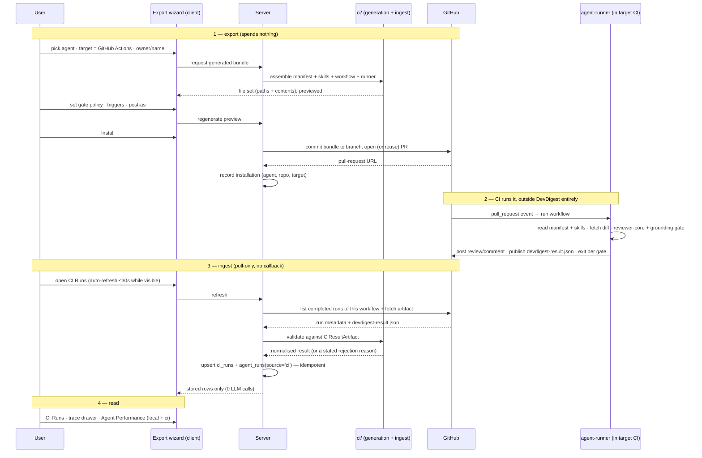

# Spec: Export to CI   |   Spec ID: SPEC-14   |   Status: draft

Lesson L07 lab. **Affected modules:** `server`, `client`, a new top-level `ci/`
package, and the pulled-in `agent-runner/` package. Cross-module, hence a root
spec. `reviewer-core` is a consumer-only dependency and is deliberately
unchanged (D9). `mcp-server` and `e2e` are non-goals for this slice (N8, N9).

> **Numbering.** `SPEC-13` is reserved for the sibling *Multi-Agent Review*
> feature, spec'd and built in a parallel worktree (branch
> `feat/multi-agent-review`). This spec is `14` so the two do not collide when
> both worktrees merge. See "Sibling feature and merge order" below.

> **Scope posture, stated once and normatively.** The product owner's
> instruction for this slice is a *deliberately narrow* implementation: ship
> the smallest thing that satisfies the acceptance criteria below, then iterate
> once real usage tells us what users actually need. Wherever a general,
> extensible design and a narrow one both satisfy an AC, the narrow one is
> correct here. Anything that looks like it *should* be generalised is recorded
> as a Non-goal, not silently built.

## Problem & Motivation

An agent in DevDigest today — "Security Reviewer", with its own system prompt,
model, linked skills, project context and eval set — only ever runs when a human
opens the studio and presses **Run Review**. Everything the product has invested
in making that agent good (SPEC-02 skills, SPEC-09 project context, SPEC-12
evals) is spent one PR at a time, by hand, on the PRs somebody remembered to
look at.

The value of a *tuned* agent is that it runs on **every** PR without anyone
remembering. That means running it where PRs are already gated: CI. And once it
runs in CI, the studio stops being the only place review results exist — so the
studio has to be able to see what its own agents did while nobody was watching.

This feature is therefore two halves that only make sense together:

1. **Out** — take an already-configured agent and deploy it into a target
   repository's GitHub Actions, as checked-in files that repository owns.
2. **Back** — ingest what those CI runs produced, so a CI review is visible in
   the studio next to local ones, and so the cost of a deployed agent is
   legible.

### This space is reserved in six independent places

Like SPEC-11's `pr_brief` and SPEC-12's `eval_cases`, this feature has extensive
reserved surface with **zero consumers**. All of it was read before drafting,
and is adopted rather than duplicated (D1):

1. **Tables.** `ci_installations` and `ci_runs` exist in
   `server/src/db/schema/ci.ts:4,14` and shipped in `0000_init.sql`. Neither is
   referenced anywhere outside the schema file and the barrel
   (`server/src/db/schema.ts:45,87`) — zero readers, zero writers, zero rows.
2. **A column.** `agent_runs.source` is `text('source', { enum: ['local','ci'] })
   .default('local')` (`server/src/db/schema/runs.ts:36`). Every run today
   writes `'local'`. **Nothing has ever written `'ci'`.** This feature is the
   first thing that should.
3. **Contracts.** `CiTarget`, `CiFile`, `AgentManifest`, `CiExportInput`,
   `CiInstallation`, `CiExport`, `CiRunStatus`, `CiRun`, `CiResultArtifact` in
   `server/src/vendor/shared/contracts/eval-ci.ts:238-344`; `CiFailOn` in
   `contracts/knowledge.ts:507`; `AgentPerf` / `AgentPerfRow` /
   `PerfCostSegment` in `contracts/productionize.ts:139-186`, whose header
   already names the route: `GET /agents/performance`.
4. **Adapter capability.** `GitHubClient.openPullRequest`, `.commitFiles` and
   `.findOpenPr` (`vendor/shared/adapters.ts:153-160`) are **fully implemented**
   in both `adapters/github/octokit.ts:235,254` and `adapters/mocks.ts:218,223`,
   and have **no product consumer**. `commitFiles` is documented as
   "Creates the branch from `base` if missing, else fast-forwards it.
   Idempotent: re-publishing just adds a new commit" — i.e. it was written for
   exactly this feature. **This resolves the "do we need a GitHub App / OAuth
   install flow?" question: no.** (D3)
5. **i18n copy.** `client/messages/en/ci.json` is a complete, unreferenced
   namespace (`runs`, `exportWizard`, `ciTab`, `publishDialog`, `page`);
   `client/messages/en/agentPerformance.json` likewise;
   `messages/en/shell.json:27-28` already carries `nav.agent-performance` and
   `nav.ci-runs` labels.
6. **UI primitives and shell wiring.** `ExportWizardSteps` and `LiveLogStream`
   exist in `client/src/vendor/ui/`; `client/src/components/app-shell/helpers.ts:48-49`
   already returns the `agent-performance` and `ci-runs` active keys.

Two corrections to the brief this spec was written from, both confirmed against
the repo and both load-bearing:

- **`AutoTriggerStatus` is *not* unmounted** — it already renders in
  `client/src/app/repos/[repoId]/pulls/_components/PullsListView/PullsListView.tsx:69`.
  It is not this feature's job to "mount it into a real page".
- **`activeKeyFor` already recognises `/ci-runs` and `/agent-performance`.** The
  wiring that is *missing* is the one `client/LEARNINGS.md` (2026-08-06, and
  again 2026-08-19 for SPEC-12) says is always missing: the `NavItemDef` entry
  in `client/src/vendor/ui/nav.ts`'s `NAV` array, plus its `SHORTCUTS` entry and
  its `icons.tsx` registry entry. Reserved i18n + a working active-key branch
  with no `NAV` item "looks *more* done than it is". See AC-51.

## Goals / Non-goals

### Goals

- **G1** — Turn an existing, already-configured agent into a checked-in GitHub
  Actions review job in a target repository, in one guided flow, without the
  user hand-writing YAML.
- **G2** — Make what will be committed **visible and reviewable before it is
  committed**: the exact file set, with contents, in the wizard.
- **G3** — Land those files in the target repository as a pull request the
  repository's own owners approve — DevDigest never pushes to a default branch.
- **G4** — Make the deployment **re-runnable**: changing an agent's gate policy
  or prompt and pressing "Update CI config" republishes without creating a
  second installation or a second PR.
- **G5** — Ingest what CI produced back into the studio, so a CI review is a
  first-class run: visible in a list, filterable, with cost, duration, severity
  counts and status.
- **G6** — Reuse the run-trace surface a user already knows from local PR
  reviews for CI runs, rather than inventing a second detail view — and state
  plainly which parts of it CI cannot fill.
- **G7** — Make a deployed agent's cost and productivity legible across **both**
  local and CI runs, so a user can answer "is this agent worth what it costs?"
- **G8** — Treat everything crossing back from CI as untrusted input, validated
  at the boundary against its existing shared contract.

### Non-goals (explicitly out of scope for this slice)

- **N1 — CircleCI, Jenkins and Generic CLI generation.** The wizard shows all
  four target cards because the design does and because `CiTarget` already
  admits all four, but **only `gha` has generation logic**. The other three are
  inert placeholders (AC-2). No config generation, no ingestion, no runner
  invocation for them.
- **N2 — A GitHub App, an OAuth install flow, or a required status check
  configured by DevDigest.** The existing fine-grained PAT
  (`SecretsProvider`, `GITHUB_TOKEN`) is the only credential. Making the check
  *required* is a repository setting the user does by hand; the wizard says so
  (`ci.json` already carries the copy: *"Requires a GitHub App — not available
  with PAT in local mode"*).
- **N3 — DevDigest receiving a webhook or an inbound callback from CI.** The
  studio is local-first and not addressable from a GitHub Actions runner.
  Ingestion is **pull-only** (D5).
- **N4 — Ingesting individual findings as `findings` rows.** The artifact
  contract `CiResultArtifact` (`eval-ci.ts:329-344`) carries **severity counts
  only, no finding bodies** — confirmed against the runner's producer
  (`agent-runner/src/artifact.ts` on `upstream/lesson-7-lab/agent-runner`). A CI
  run therefore contributes counts and cost, never triaged findings (D7, and see
  AC-46).
- **N5 — Writing `agent-runner` itself.** It is pulled in from a lesson branch
  as a precondition (AC-52), not authored here.
- **N6 — Changing `reviewer-core`.** The runner already consumes it unmodified;
  its DB/GitHub/FS-free purity is what makes CI execution possible at all
  (`reviewer-core/src/index.ts:5`, `reviewer-core/CLAUDE.md` §Non-default).
- **N7 — Designing the cross-agent findings-attribution mechanism.** Owned by
  `specs/13-multi-agent-review.md` (`AgentColumn` / `Conflict` /
  `MultiAgentRun` in `contracts/observability.ts:22-86`). This feature only
  *reads* it, and degrades if it is not there yet (D8).
- **N8 — An MCP tool** exposing CI export, CI runs, or agent performance.
- **N9 — A new e2e browser flow.** Consistent with SPEC-09/10/11/12. The
  ingestion path is proved by server integration tests against a stubbed
  GitHub client (AC-53), not by driving a browser.
- **N10 — Live streaming of an in-progress CI run.** There is no in-process
  event bus for work happening on someone else's runner (D6).
- **N11 — Scheduling, retrying or cancelling a CI run from the studio.** The
  target repository's CI owns its own runs.
- **N12 — Multi-agent CI deployment in one workflow.** One installation deploys
  exactly one agent to exactly one repository (D2).
- **N13 — Cost budgets, quotas or alerts on CI spend.** Cost is *displayed*
  (G7), never enforced.

### Decisions

- **D1 — Adopt the reserved tables and contracts; do not introduce a parallel
  set.** Both tables are empty and unread, so reshaping in place needs no
  migration shim. This is the exact trap `server/LEARNINGS.md` (2026-08-03,
  "a reserved-but-unwired column can name the exact integration point for the
  feature that will fill it") already records, and SPEC-11/SPEC-12 each paid for
  once.
- **D2 — An installation is (agent × repository × target).** Matches
  `ci_installations` as it stands (`agent_id`, `repo`, `target_type`). Deploying
  the same agent to a second repository is a second installation, which is
  exactly what the mockup's "Add repository" affordance produces.
- **D3 — Install means "DevDigest opens a pull request in the target repo".**
  Not a manual copy-paste, and not an automated push to `main`. `commitFiles` +
  `openPullRequest` + `findOpenPr` already exist, already handle the
  create-or-fast-forward branch case idempotently, and the reserved
  `CiExportInput.action` already enumerates `'open_pr' | 'files'`. The
  copy-the-YAML path survives as the **fallback** for a repository the
  configured token cannot write to (AC-10), not as the primary flow.
- **D4 — The wizard's four steps are Target → Preview → Configure → Install, in
  that order, because `ExportWizardSteps` and `ci.json` already fix those
  labels** — even though generating a preview logically needs the configure
  inputs. Resolution: the *target repository* is captured on the Target step
  (alongside the CI-system card, per `ci.json`'s `repoLabel`/`repoHint`/
  `repoPlaceholder`), Preview shows the file set generated from the agent's
  current stored config, and Configure edits the gate/trigger/post-as settings
  and **regenerates** the preview. See AC-3, AC-4.
- **D5 — Ingestion is pull-based and user-triggered.** The studio asks the CI
  provider for completed workflow runs of the installed workflow and their
  published result artifact, validates each against `CiResultArtifact`, and
  upserts. It is *not* pushed to us (N3), and the artifact is *not* fetched
  during a plain list read (AC-25).
- **D6 — CI Runs auto-refresh is a periodic client refetch, not SSE.**
  Explicit call, not a TODO. The existing SSE stream (`GET /runs/:id/events`)
  exists because the server *is* the thing executing a local run and can emit
  progress from its own process. A CI run executes on GitHub's runner; the
  server has no events to emit, only a remote state to re-query. Adding SSE
  would be a poll wearing a stream costume. Interval and visibility behaviour:
  AC-29.
- **D7 — A CI run writes two rows: a `ci_runs` row and an `agent_runs` row with
  `source='ci'`.** `ci_runs` holds what is CI-specific (installation, PR number,
  provider URL, source). `agent_runs` is what every existing cost/latency
  aggregation already reads, so writing it is what makes G7 possible without a
  second parallel aggregation path. `agent_runs.pr_id` is nullable, so a CI run
  against a repository that is not imported into DevDigest still records.
- **D8 — Attribution dependency on SPEC-13, with graceful degradation.**
  Ingestion must attribute a CI run to the agent that produced it, consistently
  with however local runs do it. Today that already exists at review level
  (`reviews.agent_id` + `reviews.run_id`, `schema/reviews.ts:17,19`); SPEC-13
  adds the per-finding cross-agent attribution. Because `CiResultArtifact`
  carries no findings (N4), **this MVP's ingestion needs only agent-level
  attribution, which already exists.** If SPEC-13's contract has not merged when
  this is implemented, ingestion stores the run *without* per-agent finding
  attribution rather than blocking (AC-23). This feature must not implement,
  reshape or pre-empt that contract (N7).
- **D9 — `reviewer-core` untouched; `ci/` owns generation, not review.** The
  `ci/` package's job is serialisation and file generation (manifest YAML,
  workflow YAML, skill bodies, runner bundle placement) plus artifact
  ingestion/normalisation. It performs no LLM call and holds no review logic.
- **D10 — The gate control offers three of `CiFailOn`'s four values.**
  `CiFailOn` is `['never','critical','warning','any']`
  (`contracts/knowledge.ts:507`) and `CI_FAIL_ON_VALUES` in the Agent editor
  already lists all four. The mockup's three-way toggle maps
  Critical→`critical`, Warning+→`warning`, Never→`never`. `any` remains a valid
  contract value (and is still settable on the Config tab) but is not offered on
  the CI tab's toggle. No contract change.
- **D11 — Generated files are data, never a shell.** No user- or agent-authored
  string (agent name, repo name, system prompt, skill body) is ever interpolated
  into a `run:` step of the generated workflow. Untrusted text reaches the
  runner only through the manifest/skill *files*, which the runner reads and
  validates itself. See AC-16 — this is the sharpest security requirement in the
  spec, because the generated file lands in someone else's CI with their
  secrets in scope.
- **D12 — The Agent Performance date range is a fixed preset set.** 7 / 30 / 90
  days, defaulting to 30 (the mockup's label). No custom picker.

### Sibling feature and merge order

- This feature owns and may change `contracts/eval-ci.ts` (and its client
  counterpart) and `contracts/productionize.ts`'s `AgentPerf*` block.
- This feature **must not touch** `contracts/observability.ts` — `AgentColumn`,
  `Conflict`, `MultiAgentRun` belong to `specs/13-multi-agent-review.md`.
- **Merge order is fixed: `feat/multi-agent-review` merges to `main` FIRST,
  `feat/export-to-ci` SECOND**, because of the attribution dependency in D8.
- The app-shell sidebar (`client/src/vendor/ui/nav.ts`) is touched by **both**
  features. This spec deliberately does not pre-resolve nav-item ordering; it
  requires only that this feature's entries are added without deleting or
  renaming the sibling's (AC-51), and that navigation is re-verified as a
  separate check after the first worktree merges.

## User stories

- **US-1** — As an agent owner, I open my tuned agent, pick a target repository
  and a CI system, and see exactly which files DevDigest would add before it
  adds anything. *(AC-1, AC-2, AC-3, AC-48)*
- **US-2** — As an agent owner, I set when the review should fail the build and
  how results get posted, and the preview updates to match. *(AC-4, AC-35)*
- **US-3** — As an agent owner, I finish the wizard and DevDigest opens a pull
  request in my target repository containing the workflow and the agent's
  config, and tells me which secret I still have to add myself.
  *(AC-5, AC-6, AC-8, AC-9, AC-11, AC-12, AC-13, AC-14)*
- **US-4** — As an agent owner whose token cannot write to the target
  repository, I am told so and handed the same files to add myself, instead of
  hitting an opaque failure. *(AC-10)*
- **US-5** — As an agent owner who changed the gate policy or the system prompt,
  I press "Update CI config" and the same deployment is republished — one
  installation, one pull request, a new commit. *(AC-7, AC-37)*
- **US-6** — As a reviewer, I open "CI Runs" and see every automated review that
  ran in CI, with its PR, agent, source, duration, findings, cost and status,
  and I can filter it down. *(AC-17, AC-19, AC-20, AC-25, AC-26, AC-27, AC-28,
  AC-32)*
- **US-7** — As a reviewer watching a PR go through CI, the list updates on its
  own without me reloading, and I can force it. *(AC-29)*
- **US-8** — As a reviewer, I open a CI run's trace and get the same drawer I
  know from local reviews, honestly telling me which parts CI didn't produce,
  with a link out to the CI logs. *(AC-30)*
- **US-9** — As an agent owner, the agent's CI tab tells me where it is deployed,
  what each deployment last did, and lets me add another repository.
  *(AC-33, AC-34, AC-36, AC-38, AC-39)*
- **US-10** — As a workspace owner, I open "Agent Performance" and see which
  agents earn their keep — runs, cost, duration, accept rate, and where the
  money goes by agent and by model. *(AC-40, AC-41, AC-42, AC-43, AC-44)*
- **US-11** — As a workspace owner judging a *CI-deployed* agent, its CI runs
  count toward its runs, cost and duration, and I am told plainly that accept
  rate cannot include them. *(AC-45, AC-46)*
- **US-12** — As someone whose CI job failed before it produced anything, or
  produced something malformed, I see a failed run with a reason instead of a
  silently missing row or a corrupt one. *(AC-18, AC-21, AC-22, AC-23)*
- **US-13** — As a security-conscious owner, a hostile agent name, repository
  name, system prompt or skill body cannot become executable content in the
  workflow DevDigest writes into my repository, and nothing coming back from CI
  can inject markup into my browser. *(AC-15, AC-16, AC-54, AC-55)*
- **US-14** — As a workspace member, I can never export, read or ingest CI data
  belonging to another workspace's agent. *(AC-24)*
- **US-15** — As a user with nothing deployed yet, every new surface tells me
  what is missing and what to do, instead of showing me zeroes.
  *(AC-31, AC-39, AC-47)*
- **US-16** — As a keyboard or screen-reader user, I can complete the wizard,
  read run statuses and read performance figures without a mouse and without
  relying on colour. *(AC-56, AC-57)*
- **US-17** — As a maintainer, I know the runner package is a precondition, and
  I know the exact commands that prove this feature typechecks and passes.
  *(AC-49, AC-50, AC-51, AC-52, AC-53)*

## Acceptance criteria (EARS)

*Terms used below.* An **installation** is one stored (agent, repository,
target) deployment (D2). A **generated bundle** is the set of files an export
produces for one installation. The **runner** is the `agent-runner` CLI
executing inside the target repository's CI. A **result artifact** is the
`devdigest-result.json` document the runner writes, shaped by
`CiResultArtifact`. **Ingestion** is the studio reading completed CI runs and
their result artifacts back into `ci_runs` / `agent_runs`.

### Export wizard — target and preview

- **AC-1** — WHEN a user opens the export flow from an agent, the system shall
  present a four-step flow labelled Target, Preview, Configure, Install, with
  the current step indicated, and shall present four CI-system options: GitHub
  Actions (marked recommended), CircleCI, Jenkins and Generic CLI.
  *Verify: the wizard renders four step labels and four target cards, with
  GitHub Actions carrying the recommended marker.*
- **AC-2** — IF a user selects CircleCI, Jenkins or Generic CLI, THEN the system
  shall state that the target is not yet available, shall not advance to the
  next step, and shall generate no files.
  *Verify: selecting each of the three non-GitHub targets leaves the wizard on
  the Target step and produces no generated file set.*
- **AC-3** — WHEN a user has chosen GitHub Actions and supplied a target
  repository in `owner/name` form, the system shall present, before anything is
  committed, the complete list of files that would be created, each with its
  path and its full contents, and shall mark which of them are editable.
  *Verify: the Preview step lists every path in the generated bundle with
  non-empty contents.*
- **AC-4** — WHEN a user changes the gate policy, the trigger events, or how
  results are posted on the Configure step, the system shall regenerate the
  previewed bundle so that the previewed contents match the chosen settings, and
  shall make no LLM call to do so.
  *Verify: switching the gate policy changes the generated manifest's
  `ci_fail_on` value in the preview, with zero provider calls.*
- **AC-5** — WHEN a user completes the Install step for a repository the
  configured credential can write to, the system shall commit the generated
  bundle to a dedicated branch in that repository as a single commit and open a
  pull request against the chosen base branch, and shall present the resulting
  pull-request URL.
  *Verify: completing the wizard against a stubbed GitHub client records one
  commit of the bundle and one opened pull request, and surfaces its URL.*
- **AC-6** — The Install step shall state which secret the target repository's
  owner must add to that repository before the workflow can run, naming it, and
  shall state that the CI-provided repository token is supplied automatically.
  *Verify: the Install step names the LLM-credential secret and does not
  instruct the user to add a token DevDigest already relies on CI to provide.*
- **AC-7** — WHEN an export is completed for an (agent, repository) pair that
  already has an installation, the system shall reuse that installation and its
  existing branch and open pull request, adding a new commit, and shall not
  create a second installation record or a second pull request.
  *Verify: exporting twice for the same agent and repository yields exactly one
  installation row and one pull-request URL.*
- **AC-8** — WHEN an export completes, the system shall record an installation
  carrying the agent, the repository, the target type and the time it was
  installed.
- **AC-9** — The system shall generate a bundle deterministically from stored
  agent configuration, making no LLM call at any step of the wizard.
  *Verify: generating the same bundle twice for an unchanged agent yields
  byte-identical contents, against a stubbed provider with zero calls.*
- **AC-10** — IF no credential is configured, or the configured credential
  cannot write to the target repository, THEN the system shall state which of
  those applies, shall create no installation record, and shall still offer the
  generated file contents for the user to add manually.
  *Verify: with a credential lacking write access, the flow reports the reason,
  leaves zero installation rows, and still renders the file contents.*

### Generated bundle — correctness and safety

- **AC-11** — The generated workflow shall run on pull-request events, limited to
  the trigger events selected on the Configure step, and shall invoke the runner
  against the pull request under review.
  *Verify: the generated workflow's trigger list equals the selected events and
  no others.*
- **AC-12** — The generated agent manifest shall validate against the shared
  `AgentManifest` contract, and shall carry the agent's name, provider, model,
  system prompt, linked skill slugs, strategy and gate policy as stored in the
  studio at generation time.
  *Verify: parsing the generated manifest with the shared contract succeeds and
  every field equals the agent's stored value.*
- **AC-13** — The generated bundle shall include a body file for every skill slug
  named in the manifest, so the runner can resolve each one without network
  access.
  *Verify: every slug in the generated manifest has a corresponding body file in
  the bundle.*
- **AC-14** — The generated bundle shall include the runner executable the
  workflow invokes, so the target repository needs no dependency on this
  repository at run time.
  *Verify: the path the generated workflow executes exists in the generated
  bundle.*
- **AC-15** — The system shall never write a secret value into any generated
  file; a generated file shall reference a credential only by the name of a CI
  secret.
  *Verify: no generated file's contents match any value held by the secrets
  provider, and the workflow references the credential by secret name only.*
- **AC-16** — The system shall never interpolate agent-authored or
  user-supplied text — agent name, repository name, system prompt, skill body,
  branch name — into a shell command inside the generated workflow; such text
  shall reach the runner only as file content or as a validated structured
  value.
  *Verify: a generated workflow for an agent whose name contains shell
  metacharacters and a newline contains no command step carrying that text, and
  the manifest still round-trips the name intact.*

### Ingestion — CI results back into the studio

- **AC-17** — WHEN a user triggers a refresh of CI runs, the system shall query
  the CI provider for completed runs of the installed workflow and shall ingest
  each one it has not already ingested.
- **AC-18** — The system shall validate every result artifact against the shared
  `CiResultArtifact` contract before storing anything from it; IF validation
  fails, THEN the system shall record the run as failed with a stated reason and
  shall store no field from the invalid document.
  *Verify: an artifact with a non-integer findings count produces a failed run
  row carrying a reason, and no counts.*
- **AC-19** — The system shall ingest each CI run at most once, so that repeated
  refreshes of the same provider run update the existing record rather than
  creating a duplicate.
  *Verify: refreshing three times over one completed CI run yields exactly one
  CI-run row.*
- **AC-20** — WHEN a CI run is ingested, the system shall record it both as a CI
  run — carrying its installation, pull-request number, time, status, findings
  count, cost and provider URL — and as an agent run whose source is `ci`.
  *Verify: an ingested CI run produces one CI-run row and one agent-run row
  whose `source` column reads `ci`, and no local run's `source` changes.*
- **AC-21** — IF a completed CI run published no result artifact — the runner
  failed before producing a review — THEN the system shall record a failed CI
  run carrying its pull-request number, time and provider URL, with no findings
  count and no cost, rather than skipping it.
  *Verify: a completed provider run with no artifact yields a failed row with
  null counts and a usable link out.*
- **AC-22** — IF an ingested artifact names an agent that no longer exists in
  the studio, THEN the system shall still record the run, attributing it to the
  installation, and shall display the artifact's agent name as recorded rather
  than failing the ingest.
- **AC-23** — WHERE the per-finding cross-agent attribution contract owned by
  SPEC-13 is available, ingestion shall attribute an ingested run's findings
  using it; WHERE it is not, the system shall store the run attributed to its
  agent and installation only, without per-finding attribution, and shall not
  fail the ingest.
  *Verify: ingestion succeeds and produces a run attributed to its agent with
  SPEC-13's contract absent.*
- **AC-24** — WHERE an installation, CI run, agent or repository belonging to
  another workspace is requested — for export, read, refresh or ingest — the
  system shall not disclose it and shall not act on it, over any surface.
  *Verify: a request naming another workspace's agent is refused before any
  installation row is read.*
- **AC-25** — The system shall make no LLM call when generating a bundle,
  ingesting a result, or rendering any surface this feature adds, and shall not
  contact the CI provider on a plain list read of stored CI runs.
  *Verify: loading the CI Runs page, the CI tab and the Agent Performance page
  against a stubbed provider and a stubbed GitHub client produces zero provider
  calls and zero GitHub calls.*

### Client surface — CI Runs

- **AC-26** — The system shall present a workspace-level CI Runs page, reachable
  from the primary sidebar navigation, stating that it lists reviews executed
  inside CI rather than local runs.
- **AC-27** — Each CI run row shall show its timestamp, its pull request as
  number and title, its agent, its source, its duration, its findings broken
  down by severity, its cost, its status, and an affordance to open its trace;
  WHERE a value was not produced, the row shall show a placeholder rather than a
  zero.
  *Verify: an ingested run with a null cost renders a placeholder in the cost
  cell, not `$0.00`.*
- **AC-28** — The CI Runs page shall offer filters by date range, agent,
  repository, status and source, and shall apply them together.
- **AC-29** — WHILE the CI Runs page is open and visible, the system shall
  refresh the list on a fixed interval of no more than 30 seconds without user
  action, shall suspend that refresh while the page is hidden, and shall offer a
  manual refresh control that also re-queries the CI provider; the automatic
  refresh shall re-query the provider at most once per installation per
  interval.
  *Verify: with the page visible, the list re-queries within 30 seconds; hiding
  the page stops further queries; pressing the manual control queries
  immediately.*
- **AC-30** — WHEN a user opens a CI run's trace, the system shall present it in
  the same run-trace surface used for local runs, populated with the fields
  ingestion produced; WHERE a section of that surface has no CI-sourced data —
  prompt assembly, tool calls, raw model output, live log — it shall state that
  the data is not available for CI runs and shall link to the run's log on the
  CI provider.
  *Verify: opening a CI run's trace renders the shared drawer, shows the
  ingested configuration and statistics, states unavailability for the
  local-only sections, and offers a provider link.*
- **AC-31** — WHERE no CI run has ever been ingested, the CI Runs page shall
  state that none exist and how to export an agent to CI, and shall render no
  table.
- **AC-32** — WHERE an ingested run's repository and pull request exist in the
  studio, the run's pull-request reference shall link to that pull request's
  page in the studio; WHERE they do not, it shall link to the pull request on
  the CI provider's host.

### Client surface — Agent editor CI tab

- **AC-33** — The agent editor shall present a CI tab alongside its existing
  tabs, selectable by the same tab mechanism and addressable by the same URL
  parameter, without altering the behaviour of the existing tabs.
  *Verify: the tab is reachable both by clicking and by the tab URL parameter,
  and the other tabs render unchanged.*
- **AC-34** — The CI tab shall state how many repositories the agent is
  currently deployed to.
- **AC-35** — The CI tab shall offer a three-way gate control — fail on critical,
  fail on warning or above, never fail — which sets the agent's stored gate
  policy, and shall explain that it controls the CI exit status and that a
  required status check is what turns that into a merge block.
  *Verify: changing the control persists the agent's gate policy and the next
  generated manifest carries the new value.*
- **AC-36** — For each installation, the CI tab shall show the repository's full
  name, its CI system, the status of its most recent ingested run and when that
  run happened.
- **AC-37** — WHEN a user activates "Update CI config" for an installation, the
  system shall regenerate that installation's bundle from the agent's current
  configuration and republish it under AC-7's reuse rules.
- **AC-38** — The CI tab shall offer an affordance to deploy the agent to an
  additional repository, which enters the same export flow with the agent
  already chosen.
- **AC-39** — WHERE an agent has no installations, the CI tab shall state that it
  is not deployed and how to deploy it, and shall render no installation list.

### Client surface — Agent Performance

- **AC-40** — The system shall present a workspace-level Agent Performance page,
  reachable from the primary sidebar navigation, not scoped to a repository.
- **AC-41** — The page shall present, for the selected date range, total runs,
  total cost, average accept rate, and the most-active agent with its run count.
- **AC-42** — The page shall present a table of agents showing, per agent, runs
  in range, average cost, average duration, accept rate with its direction of
  travel, when it last ran, and an affordance to open that agent; the table
  shall be sortable by accept rate.
- **AC-43** — The page shall offer a date range selected from a fixed set of
  presets, defaulting to 30 days, and every figure on the page shall be computed
  over the selected range.
  *Verify: switching from 30 days to 7 days changes the totals.*
- **AC-44** — The page shall present cost broken down two ways — by agent and by
  model — each with a legend naming the entry and its cost.
- **AC-45** — Runs, cost, duration and findings counts on the Agent Performance
  page shall aggregate agent runs whose source is `local` **and** those whose
  source is `ci`.
  *Verify: ingesting a CI run increases the agent's run count and total cost on
  this page.*
- **AC-46** — The system shall compute accept rate only from findings a human has
  accepted or dismissed, and shall state on the page that CI-sourced runs
  contribute no such findings; WHERE an agent's runs in range are entirely
  CI-sourced, its accept rate shall be reported as not applicable rather than as
  zero.
  *Verify: an agent with only ingested CI runs shows a not-applicable accept
  rate and the page carries the explanatory statement.*
- **AC-47** — WHERE no agent run of either source exists in the selected range,
  the page shall state that and what to do, and shall render no figures.

### Contracts, wiring and verification

- **AC-48** — Every user-visible string this feature adds shall resolve from the
  existing prepared message namespaces rather than being introduced as a new
  literal, and the feature shall not duplicate a key that already exists there.
  *Verify: the CI Runs page, the export wizard, the publish dialog, the CI tab
  and the Agent Performance page each read their copy from the prepared
  namespaces.*
- **AC-49** — Every contract this feature adds or reshapes shall be present and
  identical in both `vendor/shared` copies, and the feature shall not increase
  the existing divergence between them; specifically, the client copy shall gain
  the agent-manifest contract and the third provider identifier the server copy
  already carries.
  *Verify: a mechanical comparison of the two copies reports no divergence in
  the contract files this feature touches.*
- **AC-50** — The system shall not modify the cross-agent observability contracts
  owned by SPEC-13.
  *Verify: this feature's diff contains no change to those contracts.*
- **AC-51** — The sidebar navigation shall contain a reachable entry for each of
  this feature's two new pages, with a keyboard shortcut registered for each, and
  shall retain every entry the sibling Multi-Agent Review feature contributes,
  unrenamed.
  *Verify: both pages are reachable by clicking the sidebar, both respond to
  their registered shortcut, and the sibling's entries are present and
  unchanged.*
- **AC-52** — The runner package shall be present as a sibling package before
  this feature's export or ingestion paths are exercised; the system shall treat
  its absence as an unmet precondition with a stated reason, not as a runtime
  error inside the export flow.
  *Verify: with the runner package absent, the export flow reports the missing
  precondition rather than producing a bundle with a missing executable.*
- **AC-53** — This feature's changes shall typecheck and pass tests in every
  package they touch, and its schema usage shall run against a migrated
  database.
  *Verify: `pnpm --dir server typecheck && pnpm --dir server test`,
  `pnpm --dir client typecheck && pnpm --dir client test`, and
  `pnpm --dir agent-runner run typecheck && pnpm --dir agent-runner test` all
  pass, after `cd server && pnpm db:migrate` (migrations do not run on boot —
  root `CLAUDE.md` §Conventions).*

### Security and accessibility

- **AC-54** — The system shall render all CI-supplied and agent-supplied text —
  artifact agent names, repository names, pull-request titles, generated file
  contents shown in the preview, failure reasons — through the product's
  existing sanitised renderer, and shall not render supplied markup as markup.
  *Verify: an ingested run whose agent name contains a script tag renders it as
  visible text.*
- **AC-55** — The system shall never write a credential value into a log line, a
  stored row, a generated file, or any surface it renders.
  *Verify: exporting and ingesting with a configured credential produces no log
  line, row or rendered string containing that value.*
- **AC-56** — Every status, severity count, accept-rate direction and cost
  breakdown segment this feature renders shall be distinguishable without
  relying on colour alone, and each chart shall have a non-graphical equivalent
  conveying the same values.
- **AC-57** — Completing every wizard step, changing the gate control, filtering
  and refreshing the CI Runs list, opening a run's trace and changing the date
  range shall each be operable from the keyboard, and a change in a CI run's
  status shall be announced to assistive technology.

## Edge cases

- **Target repository is not imported into DevDigest.** The wizard accepts a
  free-text `owner/name`, so this is normal, not exceptional. The installation
  and its ingested runs exist regardless; only the in-studio pull-request link
  degrades to a provider link (AC-32) and `agent_runs.pr_id` stays null (D7).
- **Repository does not exist, or the credential cannot write to it.** Stated
  reason, no installation row, files still offered (AC-10). This is the most
  likely first-run failure, because the local-mode credential is a
  fine-grained PAT scoped to the user's own repositories.
- **Export run twice — the "Add repository" and "Update CI config" collision.**
  Same agent, same repo ⇒ one installation, new commit on the existing branch,
  existing PR reused (AC-7). Same agent, *different* repo ⇒ a second
  installation (D2).
- **The open pull request was closed or merged in the target repository, and
  then "Update CI config" is pressed.** The branch may still exist. The reuse
  rule (AC-7) must not resurrect a closed PR silently; either an open PR is
  found and reused, or a new one is opened for the same branch.
- **The workflow file is edited or deleted by the target repository's owners.**
  It is their file — this is expected and allowed. Ingestion simply stops
  finding runs; the installation stays, and its last-run figure ages. Nothing
  self-heals or re-pushes without an explicit "Update CI config".
- **CI run in progress at refresh time.** `CiRunStatus` already admits
  `running`; there is no live stream (N10, D6), so an in-progress run either
  appears with a running status or does not appear until it completes —
  whichever, it must not be recorded as failed.
- **The runner hard-failed before writing an artifact.** Its documented
  behaviour is to post nothing and write no artifact on any failure upstream of
  a grounded review. This is exactly AC-21 — a failed row with a link out, never
  a missing row and never a synthetic zero-finding success.
- **The runner exits non-zero because the gate triggered.** That is a *successful*
  review that requested changes, not a failed run. Status must distinguish
  "review ran and blocked" from "review did not run".
- **An artifact reports zero findings.** Distinct from a failure and distinct
  from "no data": the reserved `CiRunStatus` already carries `no_findings`.
- **A malformed, truncated or oversized artifact.** Rejected at the contract
  boundary with a recorded reason (AC-18). A CI artifact is produced by a job in
  a repository DevDigest does not control; it is untrusted input, not a trusted
  internal payload.
- **An artifact naming an agent that was renamed or deleted in the studio.**
  Ingest still succeeds, attributed via the installation (AC-22). The
  alternative — dropping the row — loses spend the user already paid for.
- **The same PR reviewed by two installations of two different agents.** Two
  independent CI runs, two rows. Nothing in this slice merges or compares them —
  that is SPEC-13's territory (N7, N12).
- **Agent deleted while it still has installations.** `ci_installations.agent_id`
  cascades on delete at the database level (`schema/ci.ts:7-9`), and
  `ci_runs.ci_installation_id` is `set null` — so the installation disappears
  and its runs survive orphaned. Ingested `agent_runs` rows point at
  `agents` with `set null` too. The surfaces must render an orphaned CI run
  without crashing. Note that deleting the agent does **not** remove the
  workflow file from the target repository — that file is now theirs.
- **A hostile agent name, skill body or system prompt.** The generated files land
  in *someone else's* CI, where their secrets are in scope. AC-16 is the guard,
  and it is the highest-severity requirement here: the failure mode is not "bad
  data in our database", it is arbitrary command execution in a third party's
  pipeline with their credentials.
- **A hostile pull-request title or artifact field coming back.** Rendered
  sanitised (AC-54).
- **CI provider rate limits during a refresh.** A refresh across many
  installations multiplies provider calls; the debounce in AC-29 exists for
  this. A rate-limited refresh must degrade to "could not refresh, showing
  stored data", never to an emptied list.
- **Two browser tabs both auto-refreshing.** Ingestion must stay idempotent
  (AC-19) under concurrent refreshes of the same provider run.
- **Accept rate on the Agent Performance page for a CI-only agent.** Not
  applicable, not zero (AC-46) — a CI run produces no triaged findings in this
  slice (N4). Reporting 0% for an agent nobody could triage would actively
  mislead the exact decision this page exists to support.
- **A workspace where `agent_runs` already holds only `local` rows.** Every
  aggregate must keep working before the first CI run is ever ingested — this
  page is not gated on CI existing.

## Non-functional

- **Security — writing into a third party's CI.** This feature's defining risk.
  DevDigest generates files that will execute inside a repository whose secrets
  DevDigest does not hold and cannot see. Untrusted or user-authored text must
  reach the runner as *file content*, validated by the runner, never as part of
  a command line (AC-16, D11). No secret value is ever written into a generated
  file (AC-15).
- **Security — untrusted input coming back.** A result artifact is produced by a
  job in a repository DevDigest does not control, and is fetched over the
  network. It is schema-validated at the boundary before any field is stored
  (AC-18) and rendered sanitised (AC-54). Being ingestible is not the same as
  being trustworthy.
- **Security — least privilege.** Export uses the existing credential only to
  create a branch, commit files and open a pull request in the named repository.
  Nothing in this feature pushes to a default branch, modifies repository
  settings, or configures a required status check (N2).
- **Security — access control.** `ci_installations` carries no workspace column;
  it reaches a workspace only transitively through its agent, and `ci_runs`
  reaches one only through its installation. Every export, read, refresh and
  ingest must resolve the caller's workspace before touching a row (AC-24).
- **Privacy of logs.** Export and ingest logging records repository names, run
  identifiers, counts, model, cost and status — never credential values, never
  system-prompt or skill-body contents, never diff content (AC-55).
- **Cost.** This feature spends nothing itself: generation is deterministic
  string assembly and ingestion is a read (AC-9, AC-25). The spend it *enables*
  happens on the target repository's runner, funded by the target repository's
  own LLM credential, on every qualifying pull request — which is precisely why
  the gate policy is exposed prominently (AC-35) and why per-agent cost across
  both sources is made legible (AC-45).
- **Performance.** A CI Runs list read renders from stored rows only and must not
  contact the CI provider (AC-25). Provider traffic is bounded by the debounce
  in AC-29 and suspended when the page is not visible. Ingestion latency must not
  block the surface that triggered it.
- **Reliability / idempotency.** Both halves must be safe to repeat: re-export
  converges on one installation and one pull request (AC-7), re-ingest converges
  on one run row (AC-19). Users *will* double-click, and two tabs *will*
  auto-refresh at once.
- **Backwards compatibility.** No existing route response, review behaviour, run
  execution path or `source='local'` write changes. An agent with no
  installations renders its editor exactly as today plus one tab (AC-33, AC-39).
- **Accessibility.** Statuses, severity counts, trend direction and cost
  segments are legible without colour; charts have non-graphical equivalents;
  every step and control is keyboard-operable; run status changes are announced
  (AC-56, AC-57).
- **Testing preconditions (environment, not implementation).** Proving an
  end-to-end CI run by hand requires: a fork of a demo repository with GitHub
  Actions enabled, a credential that can open a pull request there, and an
  `OPENROUTER_API_KEY` present in that repository's Actions secrets for the
  runner's model call. This is a manual demonstration precondition — the
  implementation must not attempt to provision any of it, and the automated
  verification in AC-53 must pass without it, against a stubbed GitHub client.
  The hermetic e2e stack (`./scripts/e2e.sh`) stays available but no new browser
  flow is required (N9).

## Inputs (provenance)

| Input | Provenance |
|---|---|
| Agent identity for the manifest (name, provider, model, system prompt, strategy, gate policy) | `[reused: the existing agent record and its stored configuration]` |
| Linked skill slugs and skill bodies written into the bundle | `[reused: the existing agent↔skill links and stored skill bodies (SPEC-02)]` |
| Target repository, base branch, trigger events, post-as mode | `[deterministic: user input in the wizard, validated against the existing export-input contract]` |
| Generated workflow YAML, manifest YAML, skill files | `[deterministic: template assembly from the two rows above — no LLM call (AC-9)]` |
| The runner executable placed in the bundle | `[reused: the pre-built artifact of the pulled-in agent-runner package (AC-52)]` |
| Branch creation, commit, pull-request open, existing-PR lookup | `[reused: the already-implemented GitHub adapter capabilities, currently unconsumed]` |
| Completed CI run metadata (time, status, duration, provider URL, PR number) | `[reused: read from the CI provider's API — no new judgement, no LLM]` |
| Result artifact (findings count, severity counts, cost, duration, agent, version) | `[reused: produced by the runner's own review execution inside CI — this feature makes no LLM call to obtain it]` |
| The review itself that produced the artifact | `[new: N LLM call(s) per CI run — spent on the target repository's runner with the target repository's credential, never billed through this feature's process]` |
| Stored CI run rows and agent-run rows with source `ci` | `[deterministic: normalised from the two rows above]` |
| Agent Performance figures — runs, cost, duration, accept rate, trends, cost breakdowns | `[deterministic: aggregated in code over stored agent-run and finding rows — never model-authored]` |

## Untrusted inputs

- **The result artifact fetched from CI.** Produced by a job in a repository
  DevDigest does not control, on a runner DevDigest does not control. Data,
  never instructions; schema-validated before any field is stored (AC-18).
- **CI run metadata from the provider** — pull-request title, branch name, agent
  name, failure text. Attacker-influenceable on any repository accepting outside
  contributions, and rendered in the studio. Untrusted for rendering (AC-54).
- **The agent's own name, system prompt and skill bodies, at generation time.**
  Workspace-authored, but they are written into a file that executes in a third
  party's CI. Data, never a command fragment (AC-16). This is the direction of
  trust people forget: content leaving *our* system is untrusted from the
  perspective of the system receiving it.
- **The target repository identifier supplied in the wizard.** Free text
  reaching a provider API call and a generated file. Validated as
  `owner/name`; never interpolated into a command (AC-16).
- **Pull-request content reviewed inside CI** (diff, title, body). Reaches the
  model on the runner under `reviewer-core`'s existing shared injection guard,
  which the runner is required to preserve. Not re-guarded here — restated so
  that nothing in this feature is built on the assumption that CI content is
  safer than studio content.
- **The generated file contents rendered in the wizard preview.** Assembled from
  agent-authored text and displayed in a browser. Untrusted for rendering
  (AC-54).

## Flow

## [NEEDS CLARIFICATION: …]

1. **Is the CI Runs list workspace-wide or repository-scoped?** This spec
   assumes workspace-wide (the mockup's "All repos" filter and the reserved
   `nav.ci-runs` label both point that way, and `ci_installations` has no
   repository foreign key). If it should instead live under
   `/repos/:repoId/...`, the route shape and the "All repos" filter both change.
   *Not blocking:* every AC above holds either way.
2. **Which duration does a CI run's "Dur." column report** — the runner's own
   review duration from the artifact, or the whole CI job's wall-clock time from
   the provider? They differ by checkout and install time, sometimes
   substantially. This spec does not pick one; AC-27 only requires that one be
   shown consistently and that a missing value renders as a placeholder.
3. **Should a CI run appear on the pull request's own detail page in the studio**
   (for an imported repository), next to its local runs, or only on the CI Runs
   page? AC-32 links *from* CI Runs *to* the PR, but says nothing about the
   reverse direction. Adding it later needs no contract change.
4. **What is the retention policy for ingested CI runs?** Nothing in this slice
   prunes `ci_runs` or `agent_runs`, so a busy repository accumulates rows
   indefinitely and the Agent Performance aggregates get slower over time. Out
   of scope to solve here; flagged so it is a known debt rather than a surprise.
5. **Should "Update CI config" be offered when the agent's stored configuration
   has not changed since the last publish?** A no-op republish still creates a
   commit in someone else's repository. This spec does not require detecting
   that case, but the noise is real if a user presses the button habitually.
6. **Does the wizard need to verify that the named target repository actually
   exists and is writable *before* the Install step**, rather than failing at
   Install (AC-10)? Earlier validation is friendlier but costs a provider call
   per keystroke-settled input. Left to planning.
